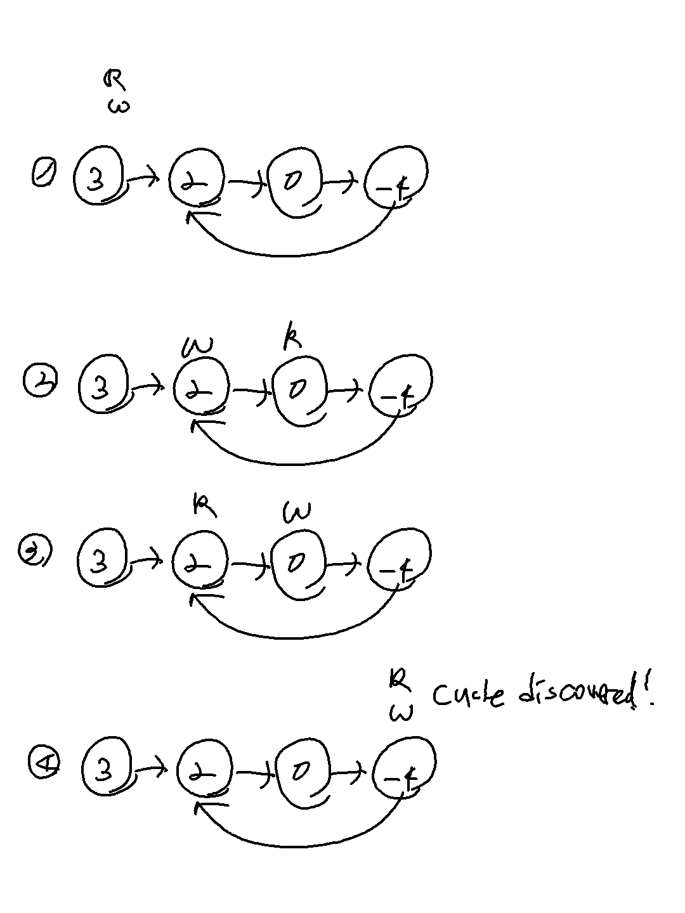

## **문제 링크**
[Question Link](https://leetcode.com/problems/linked-list-cycle/)

<br>

---
---
 
## **CODE 1**: ACCEPTED
### <u>날짜</u> 2022-05-17
#### <u>총 소요시간</u> 15m

<br>

#### <u>설계</u>

```python
'''
hashmap 사용
방문한 노드가 이미 hashmap에 있으면 return True
아니면 return False
'''
```

#### <u>코드</u>
```python
# Definition for singly-linked list.
# class ListNode:
#     def __init__(self, x):
#         self.val = x
#         self.next = None

class Solution:
    def hasCycle(self, head: Optional[ListNode]) -> bool:

        dic = {}
        
        while head:
            if head in dic:
                return True
            
            dic[head] = True
            head = head.next
        return False 
```

#### <u>디버깅</u>
```python
## revised test case
[3, 2, 0, -4]
-1
# expected == result

## one node, one cycle
[1]
0
```
<br>

#### <u>다른 방식</u>
[Discusstion Link](https://leetcode.com/problems/linked-list-cycle/discuss/44489/O(1)-Space-Solution)

```java
public boolean hasCycle(ListNode head) {
    if(head==null) return false;
    ListNode walker = head;
    ListNode runner = head;
    while(runner.next!=null && runner.next.next!=null) {
        walker = walker.next;
        runner = runner.next.next;
        if(walker==runner) return true;
    }
    return false;
}
```

---
---
