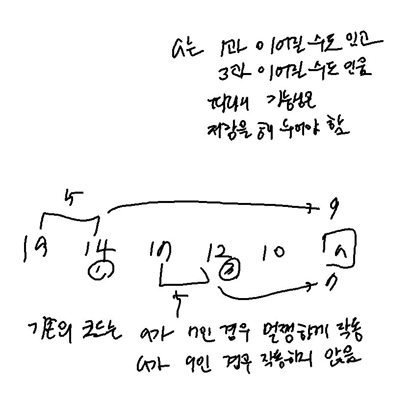

## **문제 링크**
[Question Link](https://leetcode.com/problems/longest-arithmetic-subsequence/)

<br>

---
---
 
## **CODE 1**:
### <u>날짜</u> 2022-05-18
#### <u>총 소요시간</u> 45m (설계) + 15m (1차 디버깅) + 15m (2차 디버깅) -> 시간 초과!

<br>

#### <u>설계</u>


```python
'''
                
O(n^2)까지는 가능


hashmap 사용?
마지막 인덱스

i와 j는 한 칸 이상 차이가 나야 함 (i != j)
nums[i] - nums[j]가 이미 hashmap에 있으면
    hashmap 값이 j와 같은지 확인
        hashmap의 값을 nums[i]로 수정
        dp[i] = max(dp[i], dp[j] + 1)
없으면 hashmap에 nums[i] - nums[j]를 등록
    dp[i] = max(dp[i], dp[j] + 1)
    
-5: 1
3: 3
-2: 2


[1, 2, 1, 1, 1]

'''
```

#### <u>코드</u>
(1) WA
```python
class Solution:
    def longestArithSeqLength(self, nums: List[int]) -> int:
        n = len(nums)
        dic = {}
        dp = [1]*n
        
        res = -1
        for i in range(n):
            for j in range(i-1, -1, -1):
                key = nums[i] - nums[j]
                if key in dic:
                    if dic[key] == j:
                        dp[i] = max(dp[i], dp[j]+1)
                        dic[key] = i
                    else:
                        dp[i] = max(dp[i], dp[j])
                        if dic[key] < j:
                            dic[key] = j
                else:
                    dic[key] = i
                    dp[i] = max(dp[i], 2)
            res = max(res, dp[i])
                    
        return res
```
(2) WA
```python
class Solution:
    def longestArithSeqLength(self, nums: List[int]) -> int:
        n = len(nums)
        dic = {}
        dp = [1]*n
        
        res = -1
        for i in range(n):
            for j in range(i-1, -1, -1):
                key = nums[i] - nums[j]
                if key in dic:
                    replaced = False
                    maxlen = -1
                    for idx, k in enumerate(dic[key]):
                        maxlen = max(maxlen, dp[k])
                        if k == j:
                            replaced = True
                            dic[key][idx] = i
                            dp[i] = max(dp[i], dp[j] + 1)
                    if not replaced:
                        dic[key].append(i)
                        dp[i] = max(dp[i], maxlen)
                else:
                    dic[key] = [i]
                    dp[i] = max(dp[i], 2)
            res = max(res, dp[i])
                    
        return res
```
#### <u>디버깅</u>
```python
## minimum nums.length (2)
[1, 3]
expected == result

## all values are same
[1, 1, 1, 1, 1]
expected == result

# values are increasing in different variance
[1, 2, 4, 8, 11]
expected == result

# values are decreasing in different variance
[11, 8, 7, 4, 2]
expected == result

# important case
[19, 14, 17, 12, 10, 'a']
a == 9 or 7 (두 경우 모두 expected 3)
```
코드 (1)은 마지막 케이스에서 두 경우 모두 통과하지 못함 (잘못된 가정)



코드 (2)은 마지막 케이스에서 두 경우 모두 통과하나 WA
<br>

#### <u>다른 방식</u>
[Discusstion Link](https://leetcode.com/problems/longest-arithmetic-subsequence/discuss/274611/JavaC%2B%2BPython-DP)
```python
# dp[index][diff] equals to the length of arithmetic sequence at index with difference diff.
```
---
---
