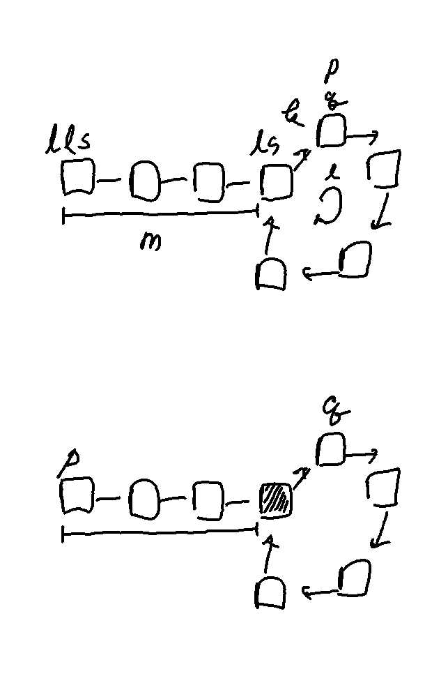

[lecture link](https://www.youtube.com/watch?v=LUm2ABqAs1w)




1. p는 두 칸, q는 한 칸씩 움직여서 만나는 점을 찾는다.

```python
p = head
q = head
while True:
    p = p.next.next
    q = q.next
    if p == q:
        break
```

2. p를 처음으로 이동시키고 q는 접점에 남아 있는 상태에서 둘 다 한 칸씩 이동시킨다. 두 점이 만나는 위치가 start of the loop

```python
while p != q:
    p = p.next
    q = q.next
```


두 번째 그림에서 start node of the loop를 찾는 방법은

위의 코드와 같다. 이것이 성립하는 이유는 무엇일까?

```
lls (linked list start)

ls (loop start)

m = lls부터 ls까지의 거리

k = ls에서 pq까지의 거리

l = loop의 길이
```


1에서 

```
p의 이동거리 = m + p*l + k

q의 이동거리 = m + q*l + k
```


그런데 p의 이동거리 = 2 * q의 이동거리 (p는 2칸, q는 1칸 이동)

`m + p*l + k = 2 ( m + q*l + k )`

위의 방정식을 정리하면

`l(p-2q) = m + k`

따라서 m+k는 l에 비례한다.

이 원리에 의해서

m = l - k

(p가 ls까지 이동하는 거리) = (q가 ls까지 이동하는 거리)
