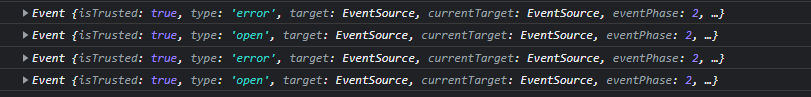

# Concept

SSE(Server-Sent Events) : HTTP 스트리밍을 통해 서버에서 클라이언트로 단방향의 Push Notification을 전송할 수 있는 HTML5 표준 기술

첫 연결 시에 데이터를 주고받은 뒤 연결된 상태를 유지하고 서버가 일방적으로 데이터를 유지한다.

HTTP/1.1 프로토콜 사용 시 브라우저에서 한 개의 도메인에 대해 생성할 수 있는 최대 EventStream의 개수는 6개이다. HTTP/2 프로토콜 사용 시에는 10개까지 유지가 가능하다.

IE를 제외한 모든 브라우저에서 사용할 수 있다.

js에서는 EventSource API를 제공한다. (일종의 인터페이스)

[document](https://developer.mozilla.org/ko/docs/Web/API/EventSource)

    EventSource
    EventSource.onopen : open event가 도착했을 때 호출
    EventSource.onmessage : message event가 도착했을 때 호출
    EventSource.onerror : error가 발생했을 때 호출되며 error event가 해당 EventSource object에 붙는다.


Spring Framework에서는 4.2부터 SseEmitter 클래스를 제공한다.

<br>

# Example

infinispan까지 적용한 예제를 공부하려니 너무 어려워서 더 쉬운 블로그 글을 찾았다.

[main document](https://sg-choi.tistory.com/542)

[sub document1](https://jsonobject.tistory.com/558)

[sub document2](https://velog.io/@max9106/Spring-SSE-Server-Sent-Events%EB%A5%BC-%EC%9D%B4%EC%9A%A9%ED%95%9C-%EC%8B%A4%EC%8B%9C%EA%B0%84-%EC%95%8C%EB%A6%BC)

<br>

## Codes

#### <b> [1] controller </b>
```java
package sse.infinispan.controller;

import lombok.extern.slf4j.Slf4j;
import org.springframework.http.MediaType;
import org.springframework.web.bind.annotation.GetMapping;
import org.springframework.web.bind.annotation.RestController;
import org.springframework.web.servlet.mvc.method.annotation.SseEmitter;

import java.util.HashSet;
import java.util.Map;
import java.util.Set;
import java.util.concurrent.ConcurrentHashMap;

@Slf4j
@RestController
public class SseController {
    private static final Map<String, SseEmitter> clients = new ConcurrentHashMap<>();

    @GetMapping("/api/subscribe")
    public SseEmitter subscribe(String id) {
        SseEmitter emitter = new SseEmitter();
        clients.put(id, emitter);
        emitter.onTimeout(() -> clients.remove(id));
        emitter.onCompletion(() -> clients.remove(id));
        return emitter;
    }

    @GetMapping("/api/publish")
    public void publish(String message) {
        Set<String> deadIds = new HashSet<>();
        clients.forEach((id, emitter) -> {
            try {
                emitter.send(message, MediaType.APPLICATION_JSON);
            } catch (Exception e) {
                deadIds.add(id);
                log.warn("disconnected id : {}", id);
            }
        });

        deadIds.forEach(clients::remove);
    }

}

```

#### <b> [2] clients </b>
```html
<!DOCTYPE html>
<html lang="en">
<head>
    <meta charset="UTF-8">
    <title>Title</title>
</head>
<body>
<input id="input"/>
<button id="send">send</button>
<pre id="messages"></pre>
<script>
  const eventSource = new EventSource(encodeURI("/api/subscribe?id=1"));
  console.log(eventSource);
  eventSource.onopen = (e) => {
      console.log(e);
  }
  eventSource.onerror = (e) => {
      console.log(e);
  }
  eventSource.onmessage = (e) => {
      document.querySelector("#messages").appendChild(document.createTextNode(e.data + "\n"));
  }
  document.querySelector("#send").addEventListener("click", () => {
      fetch(`/api/publish?message=${document.querySelector("input").value}`);
  });
</script>
</body>
</html>
```

## TroubleShooting

#### <b>1</b> : The valid characters are defined in RFC 7230 and RFC 3986

[document](https://dskim-life.tistory.com/48)

```js
const eventSource = new EventSource(encodeURI("/api/subscribe?id=${Math.random()}"));
```

<br>

#### <b>2</b> : QuerySelector is not a function

[document](https://bobbyhadz.com/blog/javascript-queryselectorall-is-not-a-function)

queryselectorall이 document 객체나 DOM element에서만 호출될 수 있다. querySelector도 마찬가지다.

```js
// before
eventSource.querySelector("#send").addEventListener("click", () => {
    fetch(`/api/publish?message=${document.querySelector("input").value}`);
});

// after
document.querySelector("#send").addEventListener("click", () => {
    fetch(`/api/publish?message=${document.querySelector("input").value}`);
});
```

<br>

#### <b> 3 </b> : 503 Service Unavailable

[document](https://jsonobject.tistory.com/558)

EventStream 생성 후 서버에서 만료 시간이 경과되었을 경우 자동으로 재생성 요청을 하지 않고 503 Service Unavailable 응답과 함께 연결을 종료한다.

최초 생성 후 만료까지 서버에서 단 한 개의 Event도 전송하지 않았을 때 발생한다.

이를 방지하기 위해서는 SseEmitter 객체를 생성하고 응답하는 과정에서 dummy Event를 같이 전송해야 한다.

```java
@GetMapping("/api/subscribe")
public SseEmitter subscribe(String id) throws IOException {
    SseEmitter emitter = new SseEmitter();
    clients.put(id, emitter);

    SseEmitter.SseEventBuilder event = SseEmitter.event()
            .id(id)
            .name("dummy")
            .data("EventStream Created. This is dummy data of [userId : " + id + "]");

    emitter.send(event);

    emitter.onTimeout(() -> clients.remove(id));
    emitter.onCompletion(() -> clients.remove(id));
    return emitter;
}
```




위의 스크린샷과 같이 만료 시간이 경과된 후 자동으로 재생성 요청을 한다.