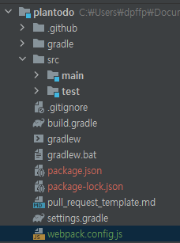
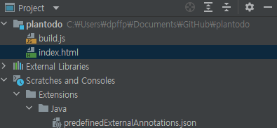
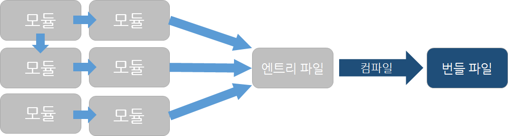

## webpack?

[네이버 D2 블로그](https://d2.naver.com/helloworld/0239818)
[공식 홈페이지 튜토리얼](https://webpack.kr/guides/getting-started)

코드를 모듈로 나누어 관리하는 모듈 시스템

이전부터 CommonJS와 AMD(Asynchronous Module Definition)이 있었는데 webpack은 두 기술의 명세를 모두 포함하고 있다.

<br>
<br>

### [1] 설치 - 첫 빌드


### <b>[trial1]</b>


0. nodeJS, npm이 설치되어 있어야 한다.

<br>

1. cmd를 켜서 설치하고자 하는 프로젝트 디렉토리로 들어간다.

<br>

2. 아래의 명령어를 차례로 입력해서 webpack을 프로젝트에 설치한다.
    ```
    npm init -y
    npm install webpack webpack-cli --save-dev
    ```

<br>

3. webpack.config.js 파일 생성, entry/output 위치 변경

    

    위의 사진에서 빨간색으로 표시된 package.json / package-lock.json은 webpack을 설치하면서 자동으로 생성된 것이다.

    ```
    webpack-demo
    |- package.json
    |- package-lock.json
    |- index.html
    |- /src
    |- index.js
    ```
    위와 같이 기본 생성값은 index.js를 엔트리 파일로 지정하게 되어 있다. 

    하지만 우리 프로젝트의 구조에 맞추기 위해 webpack.config.js 파일을 만들어서 설정해야 한다.

    package.json과 package-lock.json이 있는 위치에 webpack.config.js 파일을 수동으로 만들어준다. (사진의 초록색 글씨 참고)

    ```js
    module.exports = {
        entry: './src/main/resources/index.js',
        output: {
            path: __dirname,
            filename: "build.js"
        }
    }
    ```

    entry는 entry 파일의 위치를, 
    ouput은 빌드 파일을 추출하고 싶은 위치를 적는다.

<br>


4. mode 설정 (production / development)

    development : 소스 매핑, localhost 서버에서의 라이브 리로딩, hot module replacement 기능을 사용할 수 있도록 빌드함

    production : 로드 시간을 줄이기 위한 번들 최소화, 가벼운 소스맵, 애샛 최적화

    지금은 개발 중이기 때문에 development mode로 설정해 보겠다.

    다만 mode를 분리하더라도 중복을 제거하기 위해 공통 설정을 유지하는데, webpack-merge 유틸리티를 사용한다.

    ```console
    npm install --save-dev webpack-merge
    ```

    webpack-merge를 설치한 후 프로젝트에서 webpack.confg.js를 삭제하고 아래의 세 개 파일을 package.json / package-lock.json이 있는 폴더에 만든다.

    ```console

    |- webpack.common.js
    |- webpack.dev.js
    |- webpack.prod.js

    ```

    그리고 생성한 파일의 내용을 채워준다.
    - webpack.common.js
    ```js
    const path = require('path');
    const HtmlWebpackPlugin = require('html-webpack-plugin');

    module.exports = {
        entry: './src/main/resources/index.js',
        plugins: [
            new HtmlWebpackPlugin({
                title: 'Production',
            }),
        ],
        output: {
            path: __dirname,
            filename: "build.js",
            clean: true
        }
    }
    ```

    - webpack.dev.js
    ```js
    const { merge } = require('webpack-merge');
    const common = require('./webpack.common');

    module.exports = merge(common, {
        mode: 'development',
    })
    ```

    - webpack.prod.js
    ```js
    const { merge } = require('webpack-merge');
    const common = require('./webpack.common');

    module.exports = merge(common, {
        mode: 'production',
    })
    ```

5. package.json 수정

    ```json
    "scripts": {
    "start": "webpack serve --open --config webpack.dev.js",
    "build": "webpack --config webpack.prod.js"
    }
    ```

    webpack-dev-server를 실행하는 start 스크립트의 경우 webpack.dev.js 파일을, 프로덕션 빌드를 만들기 위한 build 스크립트의 경우 webpack.prod.js를 사용한다.

<br>

6. 새로운 설정 파일을 사용해서 빌드하기
    ```console
    npx webpack --config webpack.config.js 
    ```

    ---

    에러 발생

    ```err
    오후 4:51	Gradle sync failed: Executing Gradle tasks as part of a build without a settings file is not supported. Make sure that you are executing Gradle from a directory within your Gradle project. Your project should have a 'settings.gradle(.kts)' file in the root directory. (13 s 940 ms)
    ```

    

    아마도 위의 사진처럼 build가 되면서 settings.gradle 파일(과 모든 java 파일들이) 사라졌기 때문인 것 같다.

    따라서 설정 파일을 만들기 전으로 프로젝트를 clone받아서 다른 방법으로 시도해 본다.

<br>

### <b>[trial2]</b>
[블로그 -webpack with springboot](https://medium.com/@alvin.h/%EC%9B%B9%ED%8C%A9-%EC%8A%A4%ED%94%84%EB%A7%81%EB%B6%80%ED%8A%B8-%EA%B8%B0%EB%B0%98%EC%9D%98-%ED%94%84%EB%A1%A0%ED%8A%B8%EC%97%94%EB%93%9C-%EA%B0%9C%EB%B0%9C-%ED%99%98%EA%B2%BD-%EA%B5%AC%EC%B6%95%ED%95%98%EA%B8%B0-87cd758e1eae)

설치 방법은 trial1과 동일하다.

1. intellij에서 devtools를 사용하기 위해 설정한다.

    - File -> Settings -> Build,Execution,Deployment -> Compiler 에서 Build project automatically를 체크

    - File -> Settings -> Advanced Settings 선택 후 Allow auto-make to start even if developed application is currently running 을 체크


2. package.json을 수정한다.
    ```json
    {
    "scripts": {
        "prod": "webpack --env=production",
        "dev": "webpack-dev-server --env=development",
        "start": "npm run dev",
    },
    }
    ```

3. src/main/client에 index.js파일을 생성한다. (manually)

4. 루트 디렉토리에 webpack.config.js 파일을 생성한다. (manually)

5. webpack.config.js 파일을 작성한다.

    ```js
    const path = require('path')

    module.exports = {
        mode: 'development',
        entry: {
            index: path.resolve(__dirname, 'src/main/client/index.js')
        },
        output: {
            path: __dirname,
            filename: 'build.js'
        },
        devServer: {
            compress: true,
            port: 9000,
        }
    };
    ```
    - 주의점 : entry index 오타 주의 (client -> clients라고 잘못 적어서 Module not found 에러가 발생)
    
    - 사용중인 포트 (ex 8080)를 적으면 address already in use 에러가 발생하니 주의할 것

6. 빌드 시도
    intellij terminal에

    ```console
    npm start
    ```
    입력하면 성공적으로 빌드가 된다.

<br>
<br>

### [2] 컴파일

컴파일 : 엔트리 파일을 시작으로 의존 관계에 있는 모듈을 엮어서 하나의 번들 파일을 만드는 작업

(엔트리 파일 : 서로 의존 관계에 있는 다양한 모듈을 사용하는 시작점이 되는 파일)

(번들 파일 : 브라우저에서 실행할 수 있게 모듈을 컴파일한 파일)



=> 따라서 우리는 최상위 자바스크립트 파일의 위치를 알아야 한다.