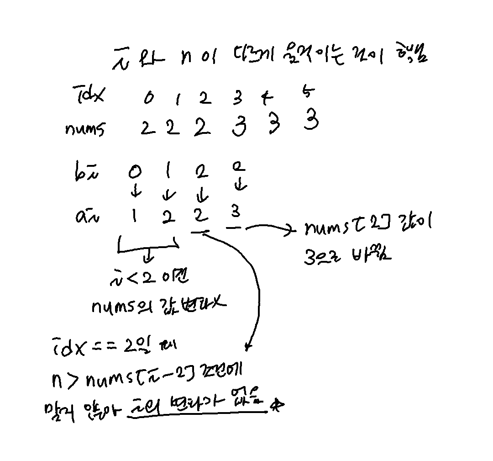

## **문제 링크**
[Question Link](https://leetcode.com/problems/remove-duplicates-from-sorted-array-ii/)

<br>

---
---
 
## **CODE 1**: ACCEPTED
### <u>날짜</u> 2022-06-22
#### <u>총 소요시간</u> 33m

<br>

#### <u>설계</u>
```python
'''
같은 원소가 두 개 이상 있는지 확인하려고 함

p1 = nums

i == i-1 == i-2이면 같은 원소가 두 개 초과로 있음

nums의 원소의 개수를 dic에 세기
두 개 초과되면 카운팅하지 않음
key를 sort
nums에 덮어쓰기
'''
```

<br>

#### <u>코드</u>
```python
from collections import deque

class Solution:
    def removeDuplicates(self, nums: List[int]) -> int:

        dic = {}
        n = len(nums)
        
        for num in nums:
            if num not in dic:
                dic[num] = 1
            else:
                if dic[num] + 1 <= 2:
                    dic[num] += 1
                
        keys = deque(sorted(list(dic.keys())))
        k = sum(dic.values())
        
        for i in range(n):
            if keys:
                nums[i] = keys[0]
                dic[keys[0]] -= 1
                
                if dic[keys[0]] <= 0:
                    keys.popleft()
        
        return k
                
```
<br>

#### <u>디버깅</u>
```python
[0]
expected == result

[1, 2]
expected == result

[2, 2]
expected == result

[2, 2, 3]
expected == result

[-1, -1, -1, 0, 0, 1]
expected == result
```
<br>

#### <u>다른 방식</u>
[Discusstion Link](https://leetcode.com/problems/remove-duplicates-from-sorted-array-ii/discuss/27976/3-6-easy-lines-C%2B%2B-Java-Python-Ruby)
```python
def removeDuplicates(self, nums):
    i = 0
    for n in nums:
        if i < 2 or n > nums[i-2]:
            nums[i] = n
            i += 1
    return i
```

---
---
