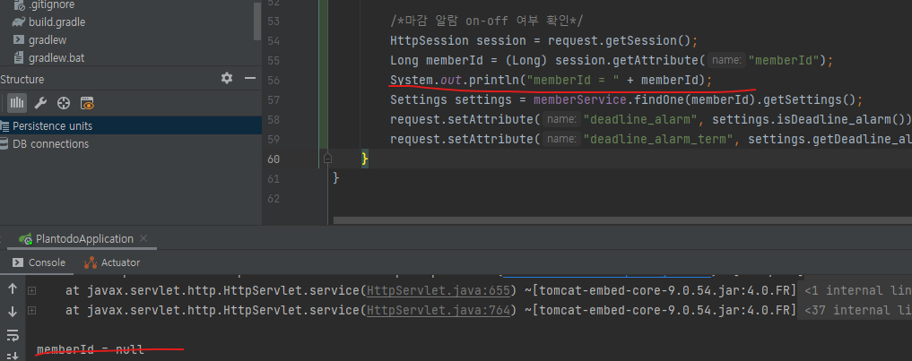

# Context

HomeRenderInterceptor에서 settings를 조회하기 위해서

```java
@Slf4j
@Component
@RequiredArgsConstructor
public class HomeRenderInterceptor implements HandlerInterceptor {
    ...
}
```

@Component로 빈 자동 등록을 해 준 후에

```java
@Configuration
@RequiredArgsConstructor
public class WebConfig implements WebMvcConfigurer {

    private final HomeRenderInterceptor homeRenderInterceptor;

    @Override
    public void addInterceptors(InterceptorRegistry registry) {
        registry.addInterceptor(new LoginCheckInterceptor())
                .order(1)
                .addPathPatterns("/**")
                .excludePathPatterns("/", "/member/join", "/member/login");

        registry.addInterceptor(homeRenderInterceptor)
                .order(3)
                .addPathPatterns("/home", "/home/*", "/member/login", "/todo/register", "/plan/register/*")
                .excludePathPatterns("/", "/member/join");
    }

}

```
webConfig에 주입했다.


<br>

# Problem

어플리케이션을 로딩, 가입, 로그인 후
redirection 시도가 여러 번 발생한 뒤 다음과 같은 Exception이 뜬다.
```console
java.lang.IllegalArgumentException: id to load is required for loading
	at org.hibernate.event.spi.LoadEvent.<init>(LoadEvent.java:96) ~[hibernate-core-5.4.32.Final.jar:5.4.32.Final]
	at org.hibernate.event.spi.LoadEvent.<init>(LoadEvent.java:64) ~[hibernate-core-5.4.32.Final.jar:5.4.32.Final]
	at org.hibernate.internal.SessionImpl$IdentifierLoadAccessImpl.doLoad(SessionImpl.java:2783) ~[hibernate-core-5.4.32.Final.jar:5.4.32.Final]
	at org.hibernate.internal.SessionImpl$IdentifierLoadAccessImpl.lambda$load$1(SessionImpl.java:2767) ~[hibernate-core-5.4.32.Final.jar:5.4.32.Final]
	at org.hibernate.internal.SessionImpl$IdentifierLoadAccessImpl.perform(SessionImpl.java:2723) ~[hibernate-core-5.4.32.Final.jar:5.4.32.Final]
	at org.hibernate.internal.SessionImpl$IdentifierLoadAccessImpl.load(SessionImpl.java:2767) ~[hibernate-core-5.4.32.Final.jar:5.4.32.Final]
	at org.hibernate.internal.SessionImpl.find(SessionImpl.java:3322) ~[hibernate-core-5.4.32.Final.jar:5.4.32.Final]
	at org.hibernate.internal.SessionImpl.find(SessionImpl.java:3284) ~[hibernate-core-5.4.32.Final.jar:5.4.32.Final]
	at jdk.internal.reflect.GeneratedMethodAccessor79.invoke(Unknown Source) ~[na:na]
	at java.base/jdk.internal.reflect.DelegatingMethodAccessorImpl.invoke(DelegatingMethodAccessorImpl.java:43) ~[na:na]
	at java.base/java.lang.reflect.Method.invoke(Method.java:566) ~[na:na]
	at org.springframework.orm.jpa.ExtendedEntityManagerCreator$ExtendedEntityManagerInvocationHandler.invoke(ExtendedEntityManagerCreator.java:362) ~[spring-orm-5.3.12.jar:5.3.12]
	at com.sun.proxy.$Proxy89.find(Unknown Source) ~[na:na]
	at jdk.internal.reflect.GeneratedMethodAccessor79.invoke(Unknown Source) ~[na:na]
	at java.base/jdk.internal.reflect.DelegatingMethodAccessorImpl.invoke(DelegatingMethodAccessorImpl.java:43) ~[na:na]
	at java.base/java.lang.reflect.Method.invoke(Method.java:566) ~[na:na]
	at org.springframework.orm.jpa.SharedEntityManagerCreator$SharedEntityManagerInvocationHandler.invoke(SharedEntityManagerCreator.java:311) ~[spring-orm-5.3.12.jar:5.3.12]
	at com.sun.proxy.$Proxy89.find(Unknown Source) ~[na:na]
	at demo.plantodo.repository.MemberRepository.findOne(MemberRepository.java:28) ~[main/:na]
	at demo.plantodo.repository.MemberRepository$$FastClassBySpringCGLIB$$57b63674.invoke(<generated>) ~[main/:na]
	at org.springframework.cglib.proxy.MethodProxy.invoke(MethodProxy.java:218) ~[spring-core-5.3.12.jar:5.3.12]
	at org.springframework.aop.framework.CglibAopProxy$CglibMethodInvocation.invokeJoinpoint(CglibAopProxy.java:783) ~[spring-aop-5.3.12.jar:5.3.12]
	at org.springframework.aop.framework.ReflectiveMethodInvocation.proceed(ReflectiveMethodInvocation.java:163) ~[spring-aop-5.3.12.jar:5.3.12]
	at org.springframework.aop.framework.CglibAopProxy$CglibMethodInvocation.proceed(CglibAopProxy.java:753) ~[spring-aop-5.3.12.jar:5.3.12]
	at org.springframework.dao.support.PersistenceExceptionTranslationInterceptor.invoke(PersistenceExceptionTranslationInterceptor.java:137) ~[spring-tx-5.3.12.jar:5.3.12]
	at org.springframework.aop.framework.ReflectiveMethodInvocation.proceed(ReflectiveMethodInvocation.java:186) ~[spring-aop-5.3.12.jar:5.3.12]
	at org.springframework.aop.framework.CglibAopProxy$CglibMethodInvocation.proceed(CglibAopProxy.java:753) ~[spring-aop-5.3.12.jar:5.3.12]
	at org.springframework.transaction.interceptor.TransactionInterceptor$1.proceedWithInvocation(TransactionInterceptor.java:123) ~[spring-tx-5.3.12.jar:5.3.12]
	at org.springframework.transaction.interceptor.TransactionAspectSupport.invokeWithinTransaction(TransactionAspectSupport.java:388) ~[spring-tx-5.3.12.jar:5.3.12]
	at org.springframework.transaction.interceptor.TransactionInterceptor.invoke(TransactionInterceptor.java:119) ~[spring-tx-5.3.12.jar:5.3.12]
	at org.springframework.aop.framework.ReflectiveMethodInvocation.proceed(ReflectiveMethodInvocation.java:186) ~[spring-aop-5.3.12.jar:5.3.12]
	at org.springframework.aop.framework.CglibAopProxy$CglibMethodInvocation.proceed(CglibAopProxy.java:753) ~[spring-aop-5.3.12.jar:5.3.12]
	at org.springframework.aop.framework.CglibAopProxy$DynamicAdvisedInterceptor.intercept(CglibAopProxy.java:698) ~[spring-aop-5.3.12.jar:5.3.12]
	at demo.plantodo.repository.MemberRepository$$EnhancerBySpringCGLIB$$29972a03.findOne(<generated>) ~[main/:na]
	at demo.plantodo.service.MemberService.findOne(MemberService.java:29) ~[main/:na]
	at demo.plantodo.interceptor.HomeRenderInterceptor.beforeHome(HomeRenderInterceptor.java:56) ~[main/:na]
	at demo.plantodo.interceptor.HomeRenderInterceptor.preHandle(HomeRenderInterceptor.java:31) ~[main/:na]
	at org.springframework.web.servlet.HandlerExecutionChain.applyPreHandle(HandlerExecutionChain.java:148) ~[spring-webmvc-5.3.12.jar:5.3.12]
	at org.springframework.web.servlet.DispatcherServlet.doDispatch(DispatcherServlet.java:1062) ~[spring-webmvc-5.3.12.jar:5.3.12]
	at org.springframework.web.servlet.DispatcherServlet.doService(DispatcherServlet.java:963) ~[spring-webmvc-5.3.12.jar:5.3.12]
	at org.springframework.web.servlet.FrameworkServlet.processRequest(FrameworkServlet.java:1006) ~[spring-webmvc-5.3.12.jar:5.3.12]
	at org.springframework.web.servlet.FrameworkServlet.doGet(FrameworkServlet.java:898) ~[spring-webmvc-5.3.12.jar:5.3.12]
	at javax.servlet.http.HttpServlet.service(HttpServlet.java:655) ~[tomcat-embed-core-9.0.54.jar:4.0.FR]
	at org.springframework.web.servlet.FrameworkServlet.service(FrameworkServlet.java:883) ~[spring-webmvc-5.3.12.jar:5.3.12]
	at javax.servlet.http.HttpServlet.service(HttpServlet.java:764) ~[tomcat-embed-core-9.0.54.jar:4.0.FR]
	at org.apache.catalina.core.ApplicationFilterChain.internalDoFilter(ApplicationFilterChain.java:227) ~[tomcat-embed-core-9.0.54.jar:9.0.54]
	at org.apache.catalina.core.ApplicationFilterChain.doFilter(ApplicationFilterChain.java:162) ~[tomcat-embed-core-9.0.54.jar:9.0.54]
	at org.apache.tomcat.websocket.server.WsFilter.doFilter(WsFilter.java:53) ~[tomcat-embed-websocket-9.0.54.jar:9.0.54]
	at org.apache.catalina.core.ApplicationFilterChain.internalDoFilter(ApplicationFilterChain.java:189) ~[tomcat-embed-core-9.0.54.jar:9.0.54]
	at org.apache.catalina.core.ApplicationFilterChain.doFilter(ApplicationFilterChain.java:162) ~[tomcat-embed-core-9.0.54.jar:9.0.54]
	at org.springframework.web.filter.RequestContextFilter.doFilterInternal(RequestContextFilter.java:100) ~[spring-web-5.3.12.jar:5.3.12]
	at org.springframework.web.filter.OncePerRequestFilter.doFilter(OncePerRequestFilter.java:119) ~[spring-web-5.3.12.jar:5.3.12]
	at org.apache.catalina.core.ApplicationFilterChain.internalDoFilter(ApplicationFilterChain.java:189) ~[tomcat-embed-core-9.0.54.jar:9.0.54]
	at org.apache.catalina.core.ApplicationFilterChain.doFilter(ApplicationFilterChain.java:162) ~[tomcat-embed-core-9.0.54.jar:9.0.54]
	at org.springframework.web.filter.FormContentFilter.doFilterInternal(FormContentFilter.java:93) ~[spring-web-5.3.12.jar:5.3.12]
	at org.springframework.web.filter.OncePerRequestFilter.doFilter(OncePerRequestFilter.java:119) ~[spring-web-5.3.12.jar:5.3.12]
	at org.apache.catalina.core.ApplicationFilterChain.internalDoFilter(ApplicationFilterChain.java:189) ~[tomcat-embed-core-9.0.54.jar:9.0.54]
	at org.apache.catalina.core.ApplicationFilterChain.doFilter(ApplicationFilterChain.java:162) ~[tomcat-embed-core-9.0.54.jar:9.0.54]
	at org.springframework.web.filter.HiddenHttpMethodFilter.doFilterInternal(HiddenHttpMethodFilter.java:94) ~[spring-web-5.3.12.jar:5.3.12]
	at org.springframework.web.filter.OncePerRequestFilter.doFilter(OncePerRequestFilter.java:119) ~[spring-web-5.3.12.jar:5.3.12]
	at org.apache.catalina.core.ApplicationFilterChain.internalDoFilter(ApplicationFilterChain.java:189) ~[tomcat-embed-core-9.0.54.jar:9.0.54]
	at org.apache.catalina.core.ApplicationFilterChain.doFilter(ApplicationFilterChain.java:162) ~[tomcat-embed-core-9.0.54.jar:9.0.54]
	at org.springframework.web.filter.CharacterEncodingFilter.doFilterInternal(CharacterEncodingFilter.java:201) ~[spring-web-5.3.12.jar:5.3.12]
	at org.springframework.web.filter.OncePerRequestFilter.doFilter(OncePerRequestFilter.java:119) ~[spring-web-5.3.12.jar:5.3.12]
	at org.apache.catalina.core.ApplicationFilterChain.internalDoFilter(ApplicationFilterChain.java:189) ~[tomcat-embed-core-9.0.54.jar:9.0.54]
	at org.apache.catalina.core.ApplicationFilterChain.doFilter(ApplicationFilterChain.java:162) ~[tomcat-embed-core-9.0.54.jar:9.0.54]
	at org.apache.catalina.core.StandardWrapperValve.invoke(StandardWrapperValve.java:197) ~[tomcat-embed-core-9.0.54.jar:9.0.54]
	at org.apache.catalina.core.StandardContextValve.invoke(StandardContextValve.java:97) ~[tomcat-embed-core-9.0.54.jar:9.0.54]
	at org.apache.catalina.authenticator.AuthenticatorBase.invoke(AuthenticatorBase.java:540) ~[tomcat-embed-core-9.0.54.jar:9.0.54]
	at org.apache.catalina.core.StandardHostValve.invoke(StandardHostValve.java:135) ~[tomcat-embed-core-9.0.54.jar:9.0.54]
	at org.apache.catalina.valves.ErrorReportValve.invoke(ErrorReportValve.java:92) ~[tomcat-embed-core-9.0.54.jar:9.0.54]
	at org.apache.catalina.core.StandardEngineValve.invoke(StandardEngineValve.java:78) ~[tomcat-embed-core-9.0.54.jar:9.0.54]
	at org.apache.catalina.connector.CoyoteAdapter.service(CoyoteAdapter.java:357) ~[tomcat-embed-core-9.0.54.jar:9.0.54]
	at org.apache.coyote.http11.Http11Processor.service(Http11Processor.java:382) ~[tomcat-embed-core-9.0.54.jar:9.0.54]
	at org.apache.coyote.AbstractProcessorLight.process(AbstractProcessorLight.java:65) ~[tomcat-embed-core-9.0.54.jar:9.0.54]
	at org.apache.coyote.AbstractProtocol$ConnectionHandler.process(AbstractProtocol.java:895) ~[tomcat-embed-core-9.0.54.jar:9.0.54]
	at org.apache.tomcat.util.net.NioEndpoint$SocketProcessor.doRun(NioEndpoint.java:1722) ~[tomcat-embed-core-9.0.54.jar:9.0.54]
	at org.apache.tomcat.util.net.SocketProcessorBase.run(SocketProcessorBase.java:49) ~[tomcat-embed-core-9.0.54.jar:9.0.54]
	at org.apache.tomcat.util.threads.ThreadPoolExecutor.runWorker(ThreadPoolExecutor.java:1191) ~[tomcat-embed-core-9.0.54.jar:9.0.54]
	at org.apache.tomcat.util.threads.ThreadPoolExecutor$Worker.run(ThreadPoolExecutor.java:659) ~[tomcat-embed-core-9.0.54.jar:9.0.54]
	at org.apache.tomcat.util.threads.TaskThread$WrappingRunnable.run(TaskThread.java:61) ~[tomcat-embed-core-9.0.54.jar:9.0.54]
	at java.base/java.lang.Thread.run(Thread.java:834) ~[na:na]
```

### <b>trial 1</b>

```java
/*마감 알람 on-off 여부 확인*/
HttpSession session = request.getSession();
Long memberId = (Long) session.getAttribute("memberId");
System.out.println("memberId = " + memberId);
Settings settings = memberService.findOne(memberId).getSettings();
request.setAttribute("deadline_alarm", settings.isDeadline_alarm());
request.setAttribute("deadline_alarm_term", settings.getDeadline_alarm_term());
```
memberId가 없을 가능성이 있다.



정말로 없었다.

원인을 추정해 보면

```java
    @Override
    public void addInterceptors(InterceptorRegistry registry) {
        ...

        registry.addInterceptor(homeRenderInterceptor)
                .order(3)
                .addPathPatterns("/home", "/home/*", "/member/login", "/todo/register", "/plan/register/*")
                .excludePathPatterns("/", "/member/join");
    }
```
homeRenderInterceptor는 "/member/login"을 포함하고 있고
prehandle과 posthandle을 구현하고 있다.
따라서 "/member/login"이 MemberController를 호출하기 전에 HomeRenderInterceptor 로직이 작동하게 된다.

그런데 preHandle이 필요한가? preHandle은 반드시 필요하다.

따라서 캘린더를 만드는 HomeRenderInterceptor는 그대로 두고
새로운 Interceptor를 만들어서 settings를 확인하는 로직이 필요한 곳에서만 수행될 수 있도록 바꿔줘야 한다. (로그인 Controller가 끝난 후, SettingsController가 끝난 후 - postHandle 필요)