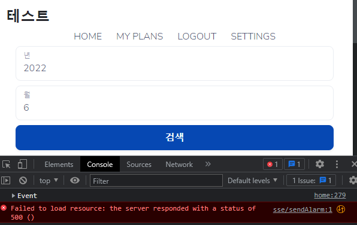
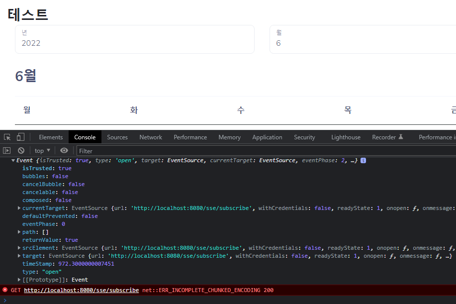
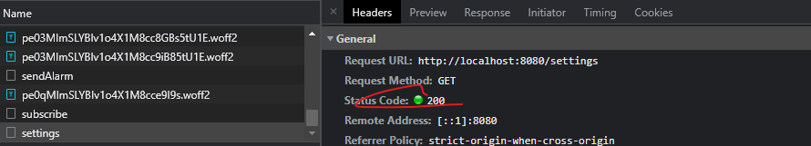
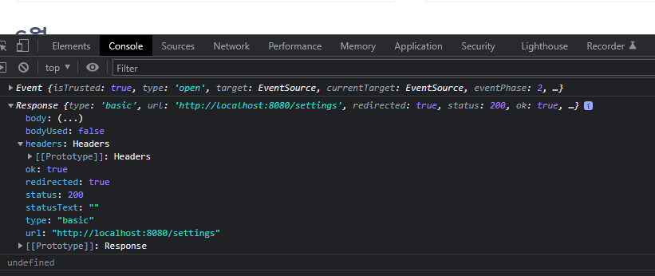
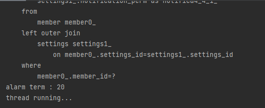
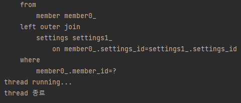
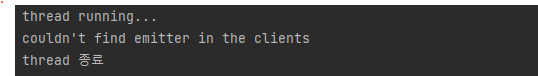

# Problem

Failed to load resource: the server responded with a status of 500 ()



subscribe는 성공했는데 sendAlarm에서 위와 같은 에러가 발생한다.

```json
{"timestamp":"2022-06-27T08:05:57.356+00:00","status":500,"error":"Internal Server Error","trace":"org.thymeleaf.exceptions.TemplateInputException: Error resolving template [sse/sendAlarm], template might not exist or might not be accessible by any of the configured Template Resolvers\r\n\tat org.thymeleaf.engine.TemplateManager.resolveTemplate(TemplateManager.java:869)\r\n\tat org.thymeleaf.engine.TemplateManager.parseAndProcess(TemplateManager.java:607)\r\n\tat org.thymeleaf.TemplateEngine.process(TemplateEngine.java:1098)\r\n\tat org.thymeleaf.TemplateEngine.process(TemplateEngine.java:1072)\r\n\tat org.thymeleaf.spring5.view.ThymeleafView.renderFragment(ThymeleafView.java:366)\r\n\tat org.thymeleaf.spring5.view.ThymeleafView.render(ThymeleafView.java:190)\r\n\tat org.springframework.web.servlet.DispatcherServlet.render(DispatcherServlet.java:1400)\r\n\tat org.springframework.web.servlet.DispatcherServlet.processDispatchResult(DispatcherServlet.java:1145)\r\n\tat org.springframework.web.servlet.DispatcherServlet.doDispatch(DispatcherServlet.java:1084)\r\n\tat org.springframework.web.servlet.DispatcherServlet.doService(DispatcherServlet.java:963)\r\n\tat org.springframework.web.servlet.FrameworkServlet.processRequest(FrameworkServlet.java:1006)\r\n\tat org.springframework.web.servlet.FrameworkServlet.doGet(FrameworkServlet.java:898)\r\n\tat javax.servlet.http.HttpServlet.service(HttpServlet.java:655)\r\n\tat org.springframework.web.servlet.FrameworkServlet.service(FrameworkServlet.java:883)\r\n\tat javax.servlet.http.HttpServlet.service(HttpServlet.java:764)\r\n\tat org.apache.catalina.core.ApplicationFilterChain.internalDoFilter(ApplicationFilterChain.java:227)\r\n\tat org.apache.catalina.core.ApplicationFilterChain.doFilter(ApplicationFilterChain.java:162)\r\n\tat org.apache.tomcat.websocket.server.WsFilter.doFilter(WsFilter.java:53)\r\n\tat org.apache.catalina.core.ApplicationFilterChain.internalDoFilter(ApplicationFilterChain.java:189)\r\n\tat org.apache.catalina.core.ApplicationFilterChain.doFilter(ApplicationFilterChain.java:162)\r\n\tat org.springframework.web.filter.RequestContextFilter.doFilterInternal(RequestContextFilter.java:100)\r\n\tat org.springframework.web.filter.OncePerRequestFilter.doFilter(OncePerRequestFilter.java:119)\r\n\tat org.apache.catalina.core.ApplicationFilterChain.internalDoFilter(ApplicationFilterChain.java:189)\r\n\tat org.apache.catalina.core.ApplicationFilterChain.doFilter(ApplicationFilterChain.java:162)\r\n\tat org.springframework.web.filter.FormContentFilter.doFilterInternal(FormContentFilter.java:93)\r\n\tat org.springframework.web.filter.OncePerRequestFilter.doFilter(OncePerRequestFilter.java:119)\r\n\tat org.apache.catalina.core.ApplicationFilterChain.internalDoFilter(ApplicationFilterChain.java:189)\r\n\tat org.apache.catalina.core.ApplicationFilterChain.doFilter(ApplicationFilterChain.java:162)\r\n\tat org.springframework.web.filter.HiddenHttpMethodFilter.doFilterInternal(HiddenHttpMethodFilter.java:94)\r\n\tat org.springframework.web.filter.OncePerRequestFilter.doFilter(OncePerRequestFilter.java:119)\r\n\tat org.apache.catalina.core.ApplicationFilterChain.internalDoFilter(ApplicationFilterChain.java:189)\r\n\tat org.apache.catalina.core.ApplicationFilterChain.doFilter(ApplicationFilterChain.java:162)\r\n\tat org.springframework.web.filter.CharacterEncodingFilter.doFilterInternal(CharacterEncodingFilter.java:201)\r\n\tat org.springframework.web.filter.OncePerRequestFilter.doFilter(OncePerRequestFilter.java:119)\r\n\tat org.apache.catalina.core.ApplicationFilterChain.internalDoFilter(ApplicationFilterChain.java:189)\r\n\tat org.apache.catalina.core.ApplicationFilterChain.doFilter(ApplicationFilterChain.java:162)\r\n\tat org.apache.catalina.core.StandardWrapperValve.invoke(StandardWrapperValve.java:197)\r\n\tat org.apache.catalina.core.StandardContextValve.invoke(StandardContextValve.java:97)\r\n\tat org.apache.catalina.authenticator.AuthenticatorBase.invoke(AuthenticatorBase.java:540)\r\n\tat org.apache.catalina.core.StandardHostValve.invoke(StandardHostValve.java:135)\r\n\tat org.apache.catalina.valves.ErrorReportValve.invoke(ErrorReportValve.java:92)\r\n\tat org.apache.catalina.core.StandardEngineValve.invoke(StandardEngineValve.java:78)\r\n\tat org.apache.catalina.connector.CoyoteAdapter.service(CoyoteAdapter.java:357)\r\n\tat org.apache.coyote.http11.Http11Processor.service(Http11Processor.java:382)\r\n\tat org.apache.coyote.AbstractProcessorLight.process(AbstractProcessorLight.java:65)\r\n\tat org.apache.coyote.AbstractProtocol$ConnectionHandler.process(AbstractProtocol.java:895)\r\n\tat org.apache.tomcat.util.net.NioEndpoint$SocketProcessor.doRun(NioEndpoint.java:1722)\r\n\tat org.apache.tomcat.util.net.SocketProcessorBase.run(SocketProcessorBase.java:49)\r\n\tat org.apache.tomcat.util.threads.ThreadPoolExecutor.runWorker(ThreadPoolExecutor.java:1191)\r\n\tat org.apache.tomcat.util.threads.ThreadPoolExecutor$Worker.run(ThreadPoolExecutor.java:659)\r\n\tat org.apache.tomcat.util.threads.TaskThread$WrappingRunnable.run(TaskThread.java:61)\r\n\tat java.base/java.lang.Thread.run(Thread.java:834)\r\n","message":"Error resolving template [sse/sendAlarm], template might not exist or might not be accessible by any of the configured Template Resolvers","path":"/sse/sendAlarm"}
```

```console
org.thymeleaf.exceptions.TemplateInputException: Error resolving template [sse/sendAlarm], template might not exist or might not be accessible by any of the configured Template Resolvers
	at org.thymeleaf.engine.TemplateManager.resolveTemplate(TemplateManager.java:869) ~[thymeleaf-3.0.12.RELEASE.jar:3.0.12.RELEASE]
	at org.thymeleaf.engine.TemplateManager.parseAndProcess(TemplateManager.java:607) ~[thymeleaf-3.0.12.RELEASE.jar:3.0.12.RELEASE]
	at org.thymeleaf.TemplateEngine.process(TemplateEngine.java:1098) ~[thymeleaf-3.0.12.RELEASE.jar:3.0.12.RELEASE]
	at org.thymeleaf.TemplateEngine.process(TemplateEngine.java:1072) ~[thymeleaf-3.0.12.RELEASE.jar:3.0.12.RELEASE]
	at org.thymeleaf.spring5.view.ThymeleafView.renderFragment(ThymeleafView.java:366) ~[thymeleaf-spring5-3.0.12.RELEASE.jar:3.0.12.RELEASE]
	at org.thymeleaf.spring5.view.ThymeleafView.render(ThymeleafView.java:190) ~[thymeleaf-spring5-3.0.12.RELEASE.jar:3.0.12.RELEASE]
	at org.springframework.web.servlet.DispatcherServlet.render(DispatcherServlet.java:1400) ~[spring-webmvc-5.3.12.jar:5.3.12]
	at org.springframework.web.servlet.DispatcherServlet.processDispatchResult(DispatcherServlet.java:1145) ~[spring-webmvc-5.3.12.jar:5.3.12]
	at org.springframework.web.servlet.DispatcherServlet.doDispatch(DispatcherServlet.java:1084) ~[spring-webmvc-5.3.12.jar:5.3.12]
	at org.springframework.web.servlet.DispatcherServlet.doService(DispatcherServlet.java:963) ~[spring-webmvc-5.3.12.jar:5.3.12]
	at org.springframework.web.servlet.FrameworkServlet.processRequest(FrameworkServlet.java:1006) ~[spring-webmvc-5.3.12.jar:5.3.12]
	at org.springframework.web.servlet.FrameworkServlet.doGet(FrameworkServlet.java:898) ~[spring-webmvc-5.3.12.jar:5.3.12]
	at javax.servlet.http.HttpServlet.service(HttpServlet.java:655) ~[tomcat-embed-core-9.0.54.jar:4.0.FR]
	at org.springframework.web.servlet.FrameworkServlet.service(FrameworkServlet.java:883) ~[spring-webmvc-5.3.12.jar:5.3.12]
	at javax.servlet.http.HttpServlet.service(HttpServlet.java:764) ~[tomcat-embed-core-9.0.54.jar:4.0.FR]
	at org.apache.catalina.core.ApplicationFilterChain.internalDoFilter(ApplicationFilterChain.java:227) ~[tomcat-embed-core-9.0.54.jar:9.0.54]
	at org.apache.catalina.core.ApplicationFilterChain.doFilter(ApplicationFilterChain.java:162) ~[tomcat-embed-core-9.0.54.jar:9.0.54]
	at org.apache.tomcat.websocket.server.WsFilter.doFilter(WsFilter.java:53) ~[tomcat-embed-websocket-9.0.54.jar:9.0.54]
	at org.apache.catalina.core.ApplicationFilterChain.internalDoFilter(ApplicationFilterChain.java:189) ~[tomcat-embed-core-9.0.54.jar:9.0.54]
	at org.apache.catalina.core.ApplicationFilterChain.doFilter(ApplicationFilterChain.java:162) ~[tomcat-embed-core-9.0.54.jar:9.0.54]
	at org.springframework.web.filter.RequestContextFilter.doFilterInternal(RequestContextFilter.java:100) ~[spring-web-5.3.12.jar:5.3.12]
	at org.springframework.web.filter.OncePerRequestFilter.doFilter(OncePerRequestFilter.java:119) ~[spring-web-5.3.12.jar:5.3.12]
	at org.apache.catalina.core.ApplicationFilterChain.internalDoFilter(ApplicationFilterChain.java:189) ~[tomcat-embed-core-9.0.54.jar:9.0.54]
	at org.apache.catalina.core.ApplicationFilterChain.doFilter(ApplicationFilterChain.java:162) ~[tomcat-embed-core-9.0.54.jar:9.0.54]
	at org.springframework.web.filter.FormContentFilter.doFilterInternal(FormContentFilter.java:93) ~[spring-web-5.3.12.jar:5.3.12]
	at org.springframework.web.filter.OncePerRequestFilter.doFilter(OncePerRequestFilter.java:119) ~[spring-web-5.3.12.jar:5.3.12]
	at org.apache.catalina.core.ApplicationFilterChain.internalDoFilter(ApplicationFilterChain.java:189) ~[tomcat-embed-core-9.0.54.jar:9.0.54]
	at org.apache.catalina.core.ApplicationFilterChain.doFilter(ApplicationFilterChain.java:162) ~[tomcat-embed-core-9.0.54.jar:9.0.54]
	at org.springframework.web.filter.HiddenHttpMethodFilter.doFilterInternal(HiddenHttpMethodFilter.java:94) ~[spring-web-5.3.12.jar:5.3.12]
	at org.springframework.web.filter.OncePerRequestFilter.doFilter(OncePerRequestFilter.java:119) ~[spring-web-5.3.12.jar:5.3.12]
	at org.apache.catalina.core.ApplicationFilterChain.internalDoFilter(ApplicationFilterChain.java:189) ~[tomcat-embed-core-9.0.54.jar:9.0.54]
	at org.apache.catalina.core.ApplicationFilterChain.doFilter(ApplicationFilterChain.java:162) ~[tomcat-embed-core-9.0.54.jar:9.0.54]
	at org.springframework.web.filter.CharacterEncodingFilter.doFilterInternal(CharacterEncodingFilter.java:201) ~[spring-web-5.3.12.jar:5.3.12]
	at org.springframework.web.filter.OncePerRequestFilter.doFilter(OncePerRequestFilter.java:119) ~[spring-web-5.3.12.jar:5.3.12]
	at org.apache.catalina.core.ApplicationFilterChain.internalDoFilter(ApplicationFilterChain.java:189) ~[tomcat-embed-core-9.0.54.jar:9.0.54]
	at org.apache.catalina.core.ApplicationFilterChain.doFilter(ApplicationFilterChain.java:162) ~[tomcat-embed-core-9.0.54.jar:9.0.54]
	at org.apache.catalina.core.StandardWrapperValve.invoke(StandardWrapperValve.java:197) ~[tomcat-embed-core-9.0.54.jar:9.0.54]
	at org.apache.catalina.core.StandardContextValve.invoke(StandardContextValve.java:97) ~[tomcat-embed-core-9.0.54.jar:9.0.54]
	at org.apache.catalina.authenticator.AuthenticatorBase.invoke(AuthenticatorBase.java:540) ~[tomcat-embed-core-9.0.54.jar:9.0.54]
	at org.apache.catalina.core.StandardHostValve.invoke(StandardHostValve.java:135) ~[tomcat-embed-core-9.0.54.jar:9.0.54]
	at org.apache.catalina.valves.ErrorReportValve.invoke(ErrorReportValve.java:92) ~[tomcat-embed-core-9.0.54.jar:9.0.54]
	at org.apache.catalina.core.StandardEngineValve.invoke(StandardEngineValve.java:78) ~[tomcat-embed-core-9.0.54.jar:9.0.54]
	at org.apache.catalina.connector.CoyoteAdapter.service(CoyoteAdapter.java:357) ~[tomcat-embed-core-9.0.54.jar:9.0.54]
	at org.apache.coyote.http11.Http11Processor.service(Http11Processor.java:382) ~[tomcat-embed-core-9.0.54.jar:9.0.54]
	at org.apache.coyote.AbstractProcessorLight.process(AbstractProcessorLight.java:65) ~[tomcat-embed-core-9.0.54.jar:9.0.54]
	at org.apache.coyote.AbstractProtocol$ConnectionHandler.process(AbstractProtocol.java:895) ~[tomcat-embed-core-9.0.54.jar:9.0.54]
	at org.apache.tomcat.util.net.NioEndpoint$SocketProcessor.doRun(NioEndpoint.java:1722) ~[tomcat-embed-core-9.0.54.jar:9.0.54]
	at org.apache.tomcat.util.net.SocketProcessorBase.run(SocketProcessorBase.java:49) ~[tomcat-embed-core-9.0.54.jar:9.0.54]
	at org.apache.tomcat.util.threads.ThreadPoolExecutor.runWorker(ThreadPoolExecutor.java:1191) ~[tomcat-embed-core-9.0.54.jar:9.0.54]
	at org.apache.tomcat.util.threads.ThreadPoolExecutor$Worker.run(ThreadPoolExecutor.java:659) ~[tomcat-embed-core-9.0.54.jar:9.0.54]
	at org.apache.tomcat.util.threads.TaskThread$WrappingRunnable.run(TaskThread.java:61) ~[tomcat-embed-core-9.0.54.jar:9.0.54]
	at java.base/java.lang.Thread.run(Thread.java:834) ~[na:na]


```

<br>

## <b> Expected Location </b>

나는 이 오류의 원인을 알고 있다..
sseController의 sendAlarm
```java
@GetMapping("/sendAlarm")
public void sendAlarm(HttpServletRequest request) {
    Long memberId = memberService.getMemberId(request);
    int deadline_alarm_term = memberService.findOne(memberId).getSettings().getDeadline_alarm_term();
    System.out.println("memberId = " + memberId);
    System.out.println("deadline_alarm_term = " + deadline_alarm_term);
    /*실험용 (나중에 new ArrayList<>() 차이에 Plan 리스트를 조회해서 넣어야 함*/
    Thread loginThread = new Thread(new SendAlarmRunnable(memberId, new ArrayList<>(), deadline_alarm_term));
    loginThread.setName("loginThread" + memberId);
    loginThread.start();
}
```

<br>

## <b> trial1 </b>

sendAlarm 컨트롤러가 String(viewName)을 리턴하는 게 아니라 void로 되어 있기 때문이다.
따라서 redirect:/settings로 String을 리턴하도록 바꿨다.
```java
@GetMapping("/sendAlarm")
public String sendAlarm(HttpServletRequest request) {
    Long memberId = memberService.getMemberId(request);
    int deadline_alarm_term = memberService.findOne(memberId).getSettings().getDeadline_alarm_term();
    /*실험용 (나중에 new ArrayList<>() 차이에 Plan 리스트를 조회해서 넣어야 함*/
    Thread loginThread = new Thread(new SendAlarmRunnable(memberId, new ArrayList<>(), deadline_alarm_term));
    loginThread.setName("loginThread" + memberId);
    loginThread.start();
    return "redirect:/settings";
}
```
그랬더니 


위와 같은 오류가 발생하면서 main-home.html을 렌더링한다.

그런데 이상한 사실은

/settings get 요청은 정상적으로 전송되었고 응답도 제대로 받았다.

그리고 오류가 발생하는 시점은
/settings get 요청이 정상적으로 200 ok 응답을 받은 뒤이다.
(그렇다고 이 요청이 문제가 없는 것은 아니다. main-home.html을 보여준다는 점에서..)

아무래도 redirection이 문제인 것 같다.

<br>

## <b> trial2 </b>

[document](https://stackoverflow.com/questions/62538985/server-sent-event-not-working-error-neterr-incomplete-chunked-encoding-200)

nodejs + express 환경이기는 하지만 sse 중에 발생한다는 점에서 유사한 상황이다.

response body의 default compression을 하지 못하게 해서 문제를 해결했다고 한다.
compression middleware는 게시글의 크기가 클 때 압축하는 라이브러리라고 생각하면 될 듯

=> 내 상황과는 관계가 없다.

<br>

## <b> trial3 </b>

```js
fetch(`/sse/sendAlarm`)
.then((response) => console.log(response))
.then((data) => console.log(data));
```

response와 data 정보를 콘솔에 찍어 보았다.



redirect가 성공적으로 이루어졌음을 알 수 있다.

## <b> trial4 </b>

[document](https://github.com/gatling/gatling/issues/3852)
[document](https://m.mkexdev.net/71)

2020.1.14 시점에 sse는 redirect를 지원하지 않는다고 한다.

In the meantime, you can disable followRedirect on this specific request and grab the Location header.

그리고 기본적으로 SSE는 Stateless하다.
SSE는 서버푸시를 하고 있는 것처럼 보이지만 (소켓 통신처럼 서버 -> 클라이언트로의 능동적인 통신 방식처럼 보이지만) 사실은 클라이언트에서 서버로 반복적으로 질의를 하는 방식이다.

이 때문에 내가 생각했던 것처럼 subscribe 1회 후 페이지를 옮겨 다닐 때마다(서로 다른 요청이 들어올 때마다) sse 연결이 유지되지 않는 것이다.

상당히 기본적인 부분인데 SSE는 뭔가 다를 거라고 생각을 했나 보다... 기대가 너무 컸다...

<br>

## <b> trial5 </b>

따라서 로직을 수정해야 한다. redirect가 영향을 미치지 않도록 각 페이지에 접속할 때마다 SSE가 연결되고 메세지를 보내는 방식으로 해야 한다.

그런데 이때 고려해야 할 점은
새로운 SSE연결이 이루어졌을 때 이전에 마지막으로 메세지를 보낸 시각을 저장하고 있다가 그 시간을 기반으로 해서 메세지를 보낼 시간을 정해야 한다는 점이다.
즉, SSE Subscribe - SSE sendMsg 사이의 텀이 SSE연결을 새로 할 때마다 새롭게 정해져야 한다. WOW!

1. 로그인 직후에 MsgCookie라는 이름의 cookie를 발행한다. 이 cookie의 만료 시간은 무한이며 logout하거나 창이 강제로 종료가 되었을 때 삭제되어야 한다.

2. MsgCookie는 last_sent_time 헤더를 포함하고 있다. 이 헤더는 메세지를 보낼 때마다 새롭게 갱신된다.

3. 각 client page에서는 subscribe 후 현재 시간 - MsgCookie cookie의 last_sent_time만큼 기다린다. (기다리는 게 가능한지 찾아봐야 함)

4. 시간이 되면 sendAlarm을 보내고 해당 페이지에 머물러 있는 동안 지속적으로 메세지를 보낸다. 메세지를 보낼 때마다 MsgCookie cookie의 last_sent_time을 갱신한다.

5. 다른 페이지로 이동하는 get요청이 발생하면 1부터 다시 시작한다.

기본적으로 이 로직을 따르는데 cookie를 사용하는 것은 요청 때마다 쿠키를 전송해야 하기 때문에 성능 저하의 원인이 될 수 있다고 한다. 따라서 로컬 스토리지나 세션 스토리지를 사용하는 것이 좋다.

<br>

### <b> 로컬 스토리지와 세션 스토리지 </b>

HTML-5에서 추가된 저장소. 간단한 키와 값을 저장할 수 있음.
로컬 스토리지의 데이터는 계속 브라우저에 남아 있지만 세션 스토리지의 데이터는 윈도우나 브라우저 탭을 닫으면 제거된다. 그래서 자동 로그인 저장 같은 정보는 로컬 스토리지, 일시적인 로그인 정보를 저장할 때는 세션 스토리지에 저장하게 된다.
window 객체 안에 들어 있으며 Storage 객체를 상속받기 때문에 공통적인 메소드를 사용한다. 
도메인별로 다르지만 대체로 5mb~10mb를 저장할 수 있다.
문자열, 불린, 숫자, null, undefined를 저장할 수 있지만 문자열로 변환된다. (키, 값 모두 같음)
로컬에만 정보를 저장한다.

-> 내 경우에는 세션 스토리지를 사용하면 될 것 같다.

다만 java(서버 측)에서는 세션 스토리지를 사용하는 것이 불가능하다. 세션 스토리지는 client browser에만 있기 때문이다.

<br>

[최종 로직]

[1] 로그인 직후

- 로그인 직후에는 서버에서 startAlarm cookie를 보내기

- main-home.html에서 cookie를 확인하고 cookie가 있으면 subscribe - sendAlarm

- sendAlarm이 성공했다면 sessionStorage에 msgLastSent 정보를 저장

- startAlarm cookie는 sessionStorage에 msgLastSent가 저장되자마자 삭제


[2] 다른 페이지

- 다른 페이지에서는 sessionStorage에서 msgLastSent만 확인

- msgLastSent - 현재 시각 / deadline_alarm_term 만큼 기다렸다가 subscribe - sendAlarm한다.

- msgLastSent를 현재 시간 정보로 갱신


[3] msgLastSentTime 관리

- 로그인 직후에 딱 한 번 생성

- 로그아웃 버튼을 클릭, 창이 강제로 종료되었을 때 (sessionStroage의 기본 기능), settings에서 on -> off상태가 되었을 때 삭제됨

- 따라서 sessionStorage에 이 값이 있다는 것은 subscribe를 해야 하며 + 메세지를 보내야 한다는 사실을 의미함.

<br>

## <b>trial6</b>

[document](https://stackoverflow.com/questions/7672858/return-only-string-message-from-spring-mvc-3-controller)

일단 이 에러의 시작점인 template method error를 해결해야 한다.
@ResponseBody는 Model이나 view name으로 string이 해석되는 것을 막아준다.

```java
@GetMapping("/sendAlarm")
@ResponseBody
public void sendAlarm(HttpServletRequest request) {
    Long memberId = memberService.getMemberId(request);
    int deadline_alarm_term = memberService.findOne(memberId).getSettings().getDeadline_alarm_term();
    /*실험용 (나중에 new ArrayList<>() 차이에 Plan 리스트를 조회해서 넣어야 함*/
    Thread loginThread = new Thread(new SendAlarmRunnable(memberId, new ArrayList<>(), deadline_alarm_term));
    loginThread.setName("loginThread" + memberId);
    loginThread.start();
}
```

이후 trial 5의 로직 중 [1]을 구현했다.

```html
<script>
    /*로그인 후 첫 home 접속 (alarmStart cookie가 있어야 함)*/
    if (isCookieExists("alarmStart")) {

        /*subscribe*/
        let uri = "/sse/subscribe";
        const eventSource = new EventSource(uri);

        /*연결이 성공적으로 이루어졌으면 cookie를 삭제*/
        deleteCookie("alarmStart");

        /*sendAlarm*/
        fetch(`/sse/sendAlarm`)
        .then(() => {
            sessionStorage.setItem("msgLastSentTime", new Date().getTime());
        })

        eventSource.onopen = (e) => {
            console.log(e);
        }

        eventSource.onerror = (e) => {
            if (e.currentTarget.readyState == EventSource.CLOSED) {
            } else {
                eventSource.close();
            }
        }

        eventSource.onmessage = (e) => {
            console.log("메세지 전송 성공!")
            let notification = new Notification('현재 메세지', {body: e.data});
            notification.actions = [
                {
                    action: 'show-uncompleted-action',
                    title: 'Message'
                }
            ]
            setTimeout(notification.close.bind(notification), 2000);
        } 
    } else {
    }

</script>
```

하지만 문제가 발생했다.

subscribe - sendAlarm까지는 200 ok

이후에 thread가 message를 전송하지 않고 있다.

eventSource.onmessage에 console.log()로 찍어본 결과 뜨지 않았다.

thread가 종료된 것일까? 이것을 어떻게 확인할 수 있을까?

<br>

## <b> trial7</b>

```java
    class SendAlarmRunnable implements Runnable {
        private Long memberId;
        private List<Plan> data = new ArrayList();
        private int alarm_term;

        public SendAlarmRunnable(Long memberId, List<Plan> data, int alarm_term) {
            this.memberId = memberId;
            this.data = data;
            this.alarm_term = alarm_term;
        }

        @Override
        public void run() {
            while (!Thread.interrupted()) {
                System.out.println("thread running...");
                if (clients.containsKey(memberId)) {
                    SseEmitter client = clients.get(memberId);
                    try {
                        /*data를 가공해서 alarm 전송*/
                        client.send("dummy data - 나중에 수정");
                        Thread.sleep(alarm_term*1000);
                    } catch (InterruptedException ie) {
                        ie.printStackTrace();
                        break;
                    } catch (IOException ioe) {
                        ioe.printStackTrace();
                        break;
                    }
                } else {
                    break;
                }
            }
        }
    }
```

thread 내부에 로그를 찍어서 thread가 정상적으로 동작하고 있는지 확인해보자.



thread running이 한 번 로그로 찍히고 그 다음부터는 반응이 없다.

```java
@Override
public void run() {
	while (!Thread.interrupted()) {
		System.out.println("thread running...");
		if (clients.containsKey(memberId)) {
			SseEmitter client = clients.get(memberId);
			try {
				/*data를 가공해서 alarm 전송*/
				client.send("dummy data - 나중에 수정");
				Thread.sleep(alarm_term*1000);
			} catch (InterruptedException ie) {
				ie.printStackTrace();
				break;
			} catch (IOException ioe) {
				ioe.printStackTrace();
				break;
			}
		} else {
			break;
		}
	}
	System.out.println("thread 종료");
}
```
run 메서드의 마지막에 thread 종료 여부를 로그로 찍어서 확인해 보았다.



thread가 바로 종료되었음을 확인할 수 있었다.

왜 thread가 바로 종료되는 것일까? 

thread는 interruptedException, IOException이 터질 때나 client에 key가 없을 때 종료된다.

```java
@Override
public void run() {
	while (!Thread.interrupted()) {
		System.out.println("thread running...");
		if (clients.containsKey(memberId)) {
			SseEmitter client = clients.get(memberId);
			try {
				/*data를 가공해서 alarm 전송*/
				client.send("dummy data - 나중에 수정");
				Thread.sleep(alarm_term*1000);
			} catch (InterruptedException ie) {
				ie.printStackTrace();
				break;
			} catch (IOException ioe) {
				ioe.printStackTrace();
				break;
			}
		} else {
			System.out.println("couldn't find emitter in the clients");
			break;
		}
	}
	System.out.println("thread 종료");
}  
```


clients에서 emitter를 찾을 수 없기 때문에 메세지를 보내지 않고 바로 thread를 종료하는 것이다.

그런데 분명히 sendAlarm 이전에 subscribe를 하면서 emitter를 연결했는데 왜 이러지?

<br>

### <b> success </b>

```java
@Controller
@RequestMapping("/sse")
@RestController
@RequiredArgsConstructor
public class SseController {
```
@RestController 어노테이션을 빼먹었고

```java
@GetMapping("/sendAlarm")
public void sendAlarm(HttpServletRequest request) {
	Long memberId = memberService.getMemberId(request);
	int deadline_alarm_term = memberService.findOne(memberId).getSettings().getDeadline_alarm_term();
	/*실험용 (나중에 new ArrayList<>() 차이에 Plan 리스트를 조회해서 넣어야 함*/
	Thread loginThread = new Thread(new SendAlarmRunnable(memberId, new ArrayList<>(), deadline_alarm_term));
	loginThread.setName("loginThread" + memberId);
	loginThread.start();
}
```
여기에 @ResponseBody를 붙이면 안 되기 때문이다.

그리고 당연한 말이지만 @RestController와 @Controller를 같이 쓰면 동작하지 않는다.

@RestController를 사용해야 하는 이유는 @Controller에서 @GetMapping이 붙은 메서드는 무언가 (view네임 같은)를 리턴해야 하기 때문이다. @ResponseBody를 붙여서 강제로 void를 쓸 수는 있지만 좋은 생각은 아니다.
