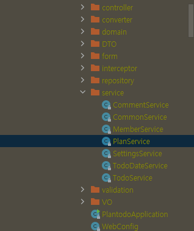

---
title: "PlanServiceTest.findUrgentPlansWithEmphasis_Test | java.lang.NoClassDefFoundError Caused by: java.lang.ClassNotFoundException at BuiltinClassLoader.java:581"
excerpt: ""

categories:
    - trouble-shooting
tags:
    - [ptd, \#13, p5]

toc: true

date: 2022-06-29
last_modified_at: 2022-06-29
--- 


# Problem

findUrgentPlansWithEmphasis_Test를 실행

```console
6월 29, 2022 3:20:55 오후 org.junit.platform.launcher.core.EngineDiscoveryOrchestrator lambda$logTestDescriptorExclusionReasons$7
INFO: 0 containers and 10 tests were Method or class mismatch

Ldemo/plantodo/service/PlanService;
java.lang.NoClassDefFoundError: Ldemo/plantodo/service/PlanService;
	at java.base/java.lang.Class.getDeclaredFields0(Native Method)
	at java.base/java.lang.Class.privateGetDeclaredFields(Class.java:3061)
	at java.base/java.lang.Class.getDeclaredFields(Class.java:2248)
	at org.junit.platform.commons.util.ReflectionUtils.getDeclaredFields(ReflectionUtils.java:1433)
	at org.junit.platform.commons.util.ReflectionUtils.findAllFieldsInHierarchy(ReflectionUtils.java:1163)
	at org.junit.platform.commons.util.ReflectionUtils.findFields(ReflectionUtils.java:1151)
	at org.junit.platform.commons.util.AnnotationUtils.findAnnotatedFields(AnnotationUtils.java:371)
	at org.junit.platform.commons.util.AnnotationUtils.findAnnotatedFields(AnnotationUtils.java:348)
	at org.junit.jupiter.engine.descriptor.ExtensionUtils.registerExtensionsFromFields(ExtensionUtils.java:99)
	at org.junit.jupiter.engine.descriptor.ClassBasedTestDescriptor.prepare(ClassBasedTestDescriptor.java:148)
	at org.junit.jupiter.engine.descriptor.ClassBasedTestDescriptor.prepare(ClassBasedTestDescriptor.java:78)
	at org.junit.platform.engine.support.hierarchical.NodeTestTask.lambda$prepare$1(NodeTestTask.java:111)
	at org.junit.platform.engine.support.hierarchical.ThrowableCollector.execute(ThrowableCollector.java:73)
	at org.junit.platform.engine.support.hierarchical.NodeTestTask.prepare(NodeTestTask.java:111)
	at org.junit.platform.engine.support.hierarchical.NodeTestTask.execute(NodeTestTask.java:79)
	at java.base/java.util.ArrayList.forEach(ArrayList.java:1541)
	at org.junit.platform.engine.support.hierarchical.SameThreadHierarchicalTestExecutorService.invokeAll(SameThreadHierarchicalTestExecutorService.java:38)
	at org.junit.platform.engine.support.hierarchical.NodeTestTask.lambda$executeRecursively$5(NodeTestTask.java:143)
	at org.junit.platform.engine.support.hierarchical.ThrowableCollector.execute(ThrowableCollector.java:73)
	at org.junit.platform.engine.support.hierarchical.NodeTestTask.lambda$executeRecursively$7(NodeTestTask.java:129)
	at org.junit.platform.engine.support.hierarchical.Node.around(Node.java:137)
	at org.junit.platform.engine.support.hierarchical.NodeTestTask.lambda$executeRecursively$8(NodeTestTask.java:127)
	at org.junit.platform.engine.support.hierarchical.ThrowableCollector.execute(ThrowableCollector.java:73)
	at org.junit.platform.engine.support.hierarchical.NodeTestTask.executeRecursively(NodeTestTask.java:126)
	at org.junit.platform.engine.support.hierarchical.NodeTestTask.execute(NodeTestTask.java:84)
	at org.junit.platform.engine.support.hierarchical.SameThreadHierarchicalTestExecutorService.submit(SameThreadHierarchicalTestExecutorService.java:32)
	at org.junit.platform.engine.support.hierarchical.HierarchicalTestExecutor.execute(HierarchicalTestExecutor.java:57)
	at org.junit.platform.engine.support.hierarchical.HierarchicalTestEngine.execute(HierarchicalTestEngine.java:51)
	at org.junit.platform.launcher.core.EngineExecutionOrchestrator.execute(EngineExecutionOrchestrator.java:108)
	at org.junit.platform.launcher.core.EngineExecutionOrchestrator.execute(EngineExecutionOrchestrator.java:88)
	at org.junit.platform.launcher.core.EngineExecutionOrchestrator.lambda$execute$0(EngineExecutionOrchestrator.java:54)
	at org.junit.platform.launcher.core.EngineExecutionOrchestrator.withInterceptedStreams(EngineExecutionOrchestrator.java:67)
	at org.junit.platform.launcher.core.EngineExecutionOrchestrator.execute(EngineExecutionOrchestrator.java:52)
	at org.junit.platform.launcher.core.DefaultLauncher.execute(DefaultLauncher.java:96)
	at org.junit.platform.launcher.core.DefaultLauncher.execute(DefaultLauncher.java:75)
	at org.gradle.api.internal.tasks.testing.junitplatform.JUnitPlatformTestClassProcessor$CollectAllTestClassesExecutor.processAllTestClasses(JUnitPlatformTestClassProcessor.java:99)
	at org.gradle.api.internal.tasks.testing.junitplatform.JUnitPlatformTestClassProcessor$CollectAllTestClassesExecutor.access$000(JUnitPlatformTestClassProcessor.java:79)
	at org.gradle.api.internal.tasks.testing.junitplatform.JUnitPlatformTestClassProcessor.stop(JUnitPlatformTestClassProcessor.java:75)
	at org.gradle.api.internal.tasks.testing.SuiteTestClassProcessor.stop(SuiteTestClassProcessor.java:61)
	at java.base/jdk.internal.reflect.NativeMethodAccessorImpl.invoke0(Native Method)
	at java.base/jdk.internal.reflect.NativeMethodAccessorImpl.invoke(NativeMethodAccessorImpl.java:62)
	at java.base/jdk.internal.reflect.DelegatingMethodAccessorImpl.invoke(DelegatingMethodAccessorImpl.java:43)
	at java.base/java.lang.reflect.Method.invoke(Method.java:566)
	at org.gradle.internal.dispatch.ReflectionDispatch.dispatch(ReflectionDispatch.java:36)
	at org.gradle.internal.dispatch.ReflectionDispatch.dispatch(ReflectionDispatch.java:24)
	at org.gradle.internal.dispatch.ContextClassLoaderDispatch.dispatch(ContextClassLoaderDispatch.java:33)
	at org.gradle.internal.dispatch.ProxyDispatchAdapter$DispatchingInvocationHandler.invoke(ProxyDispatchAdapter.java:94)
	at com.sun.proxy.$Proxy2.stop(Unknown Source)
	at org.gradle.api.internal.tasks.testing.worker.TestWorker$3.run(TestWorker.java:193)
	at org.gradle.api.internal.tasks.testing.worker.TestWorker.executeAndMaintainThreadName(TestWorker.java:129)
	at org.gradle.api.internal.tasks.testing.worker.TestWorker.execute(TestWorker.java:100)
	at org.gradle.api.internal.tasks.testing.worker.TestWorker.execute(TestWorker.java:60)
	at org.gradle.process.internal.worker.child.ActionExecutionWorker.execute(ActionExecutionWorker.java:56)
	at org.gradle.process.internal.worker.child.SystemApplicationClassLoaderWorker.call(SystemApplicationClassLoaderWorker.java:133)
	at org.gradle.process.internal.worker.child.SystemApplicationClassLoaderWorker.call(SystemApplicationClassLoaderWorker.java:71)
	at worker.org.gradle.process.internal.worker.GradleWorkerMain.run(GradleWorkerMain.java:69)
	at worker.org.gradle.process.internal.worker.GradleWorkerMain.main(GradleWorkerMain.java:74)
Caused by: java.lang.ClassNotFoundException: demo.plantodo.service.PlanService
	at java.base/jdk.internal.loader.BuiltinClassLoader.loadClass(BuiltinClassLoader.java:581)
	at java.base/jdk.internal.loader.ClassLoaders$AppClassLoader.loadClass(ClassLoaders.java:178)
	at java.base/java.lang.ClassLoader.loadClass(ClassLoader.java:521)
	... 57 more


PlanServiceTest > initializationError FAILED
    java.lang.NoClassDefFoundError at Class.java:-2
        Caused by: java.lang.ClassNotFoundException at BuiltinClassLoader.java:581
```
<br>
<br>

## <b> ▶️ trial1 </b>

planService의 class파일을 로딩하는 데 실패했다고 한다.

[document](https://nhj12311.tistory.com/88)

1. Class.forName()을 직접 사용한 경우 -> 내 경우는 아님
2. ClassLoader.loadClass(String className) 처럼 String으로 클래스를 찾는 경우
```java
public Class<?> loadClass(String name) throws ClassNotFoundException {
    return loadClass(name, false);
}
```

실행환경에서 참조하는 jar파일이나 class파일이 있는지 확인해 보자.



이처럼 PlanService.class 파일이 있는 것을 확인할 수 있다.

<br>
<br>

## <b> ▶️ trial2 </b>

[document](https://codechacha.com/ko/java-classnotfoundexception/)

빌드 산출물을 모두 클리어 및 초기화하여 다시 빌드해 보자.

- invalidate caches

- reload all from disc

다시 빌드했더니 NoClassDefFoundError는 해결되었다.

하지만 이건 일시적인 방편에 불과했다.

간헐적으로 계속 NoClassDefFoundError가 발생한다.

<br>
<br>

## <b> ✅ success </b>

[document](https://stackoverflow.com/questions/4228047/java-lang-noclassdeffounderror-in-junit)

junit에 문제가 있나 싶어서 검색에 junit 키워드를 같이 넣어서 검색했다.

- test를 junit4를 사용하도록 고정 -> not work

	```java
	@Transactional
	@SpringBootTest
	@RunWith(JUnit4.class)
	class PlanServiceTest {
	```

- junit4 -> junit5로 업데이트 -> success

	[document](https://junit.org/junit5/docs/current/user-guide/)
	[example](https://github.com/junit-team/junit5-samples/blob/r5.8.2/junit5-jupiter-starter-gradle/build.gradle)


	```gradle
	testImplementation(platform('org.junit:junit-bom:5.8.2'))
	testImplementation('org.junit.jupiter:junit-jupiter')
	```

	#### <b> 🔻minor issue </b>
	Failed to load ApplicationContext <= UnsatisfiedDependencyException

	1. ContextConfiguration -> failed
	```java
	@ContextConfiguration(classes = {PlanService.class, MemberService.class, TodoDateService.class, TodoService.class})
	```

	2. SpringBootTest(classes) -> success
	```java
	@Transactional
	@SpringBootTest(classes = {PlantodoApplication.class})
	class PlanServiceTest {}
	```
	프로젝트 root application class를 지정해주었더니 해결되었다.

<br>

결론적으로 버전 문제가 맞았던 것 같다. junit을 4 -> 5로 바꾸고 @SpringBootTest의 classes를 root application으로 지정함으로써 모든 문제를 해결했다.