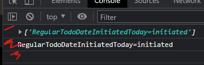
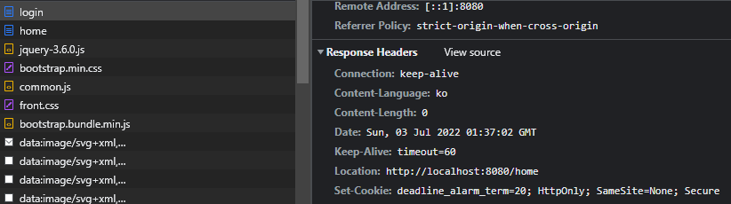
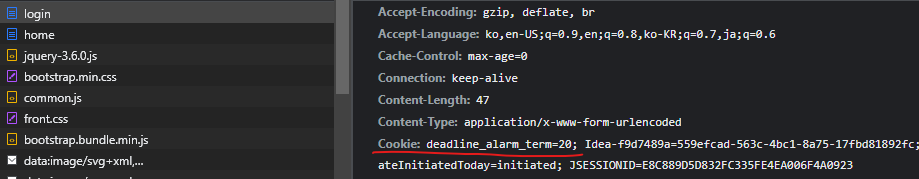
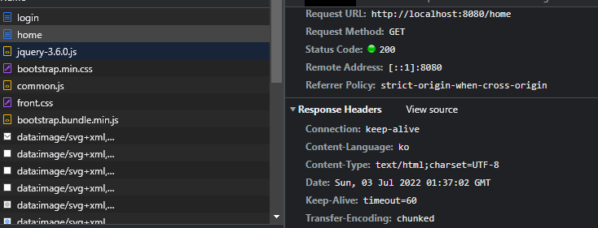
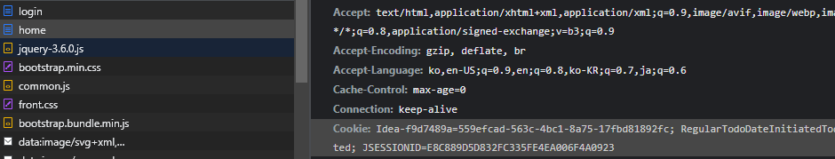

# Problem

로그인 후 deadline_alarm_term 쿠키를 브라우저에 저장했는데
main-home.html의 스크립트에서 쿠키를 가져오려고 할 때 deadline_alarm_term 쿠키를 찾을 수 없다.



1번과 3번에서 deadline_alarm_term 쿠키가 저장되지 않았음을 확인할 수 있다.

## <b> ▶️ trial1 </b> 실패

[document](https://stackoverflow.com/questions/59808537/cookies-headers-are-present-but-cookies-are-not-stored-in-browser)

CORS를 사용하고 있는지 생각해 보자.

로그인 ("/member/login")에서 쿠키를 저장하고 ("/home")에서 쿠키를 조회한다.

웹 어플리케이션은 리소스가 자신의 출처(도메인, 프로토콜, 포트)와 다를 때 CORS를 실행한다.

예를 들어 https://domain-a.com의 프론트엔드 JS코드가 https://domain-b.com/data.json을 요청하는 경우가 있다.

브라우저는 스크립트에서 시작한 CORS요청을 제한한다.

요청을 할 때 withCredentials을 사용하고
Chrome의 경우 SameSite=None과 Secure directives를 cookie에 추가해 보자.


```java
if (settings.isDeadline_alarm()) {
    Cookie cookie = new Cookie("deadline_alarm_term", String.valueOf(settings.getDeadline_alarm_term()));
    response.addCookie(cookie);
    response.setHeader("Set-Cookie", "key=value; HttpOnly; SameSite=None");
}
```

<br>

## <b> ▶️ trial2 </b>

[document](https://medium.com/swlh/7-keys-to-the-mystery-of-a-missing-cookie-fdf22b012f09)

- SameSite=None 헤더를 쓸 경우 cookie에 secure flag를 달아야 한다 -> failed
```java
if (settings.isDeadline_alarm()) {
    Cookie cookie = new Cookie("deadline_alarm_term", String.valueOf(settings.getDeadline_alarm_term()));
    cookie.setSecure(true);
    response.addCookie(cookie);
    response.setHeader("Set-Cookie", "key=value; HttpOnly; SameSite=None");
}
```

<br>

## <b> ▶️ trial3 </b>

[document](https://stackoverflow.com/questions/54215087/cookies-disappear-after-redirect)

```java
if (settings.isDeadline_alarm()) {
//            Cookie cookie = new Cookie("deadline_alarm_term", String.valueOf(settings.getDeadline_alarm_term()));
    response.setHeader("Set-Cookie", "deadline_alarm_term="+settings.getDeadline_alarm_term()+"; HttpOnly; SameSite=None; Secure");
//            response.addCookie(cookie);
}
```



login에는 Set-Cookie 헤더가 들어 있다.



그리고 실제로 쿠키가 세팅된 것도 확인할 수 있다.



하지만 home으로 redirect된 뒤에는 Set-Cookie헤더가 없음은 물론이고



쿠키 또한 사라져 있다.

<br>

## <b> ✅ success </b>

[document](https://stackoverflow.com/questions/4694089/sending-browser-cookies-during-a-302-redirect)

[document](https://developer.mozilla.org/ko/docs/Web/HTTP/Headers/Set-Cookie)

[document](https://stackoverflow.com/questions/46063816/http-redirect-302-doesnt-use-cookie-in-following-get-request)

origin server를 포함하지 않은 domain에 속한 쿠키는 user agent에 의해 rejected된다.

따라서 방법을 바꿔서 deadline_alarm_term 정보를 session에 담아서 주고
첫 로그인 때 deadline_alarm_term을 sessionStorage에 담은 다음 subscribe - sendAlarm
하는 방법으로 해결했다.