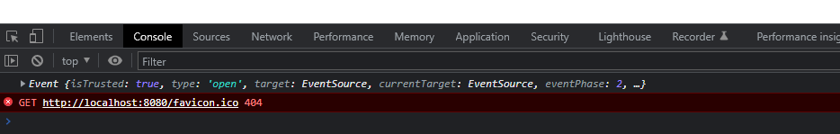

# Problem

로그인 후 갑자기 발생했다.



<br>

## <b> ✅ success </b>

[document](https://developer-doreen.tistory.com/26)

이 문제의 해결방법은 크게 두 가지다.

1. head 안에 link tag를 넣어서 해결
```html
<html>
<head>
<link rel="shortcut icon" href="#">
</head>
</html>
```
그런데 이 방법은 서블릿이나 컨트롤러를 두 번 호출하는 문제가 있다고 한다.
[document](https://cheonfamily.tistory.com/7)

2. 실제로 favicon icon을 넣어준다.

static/img 폴더에 favicon icon으로 쓸 이미지를 넣어주고 1번의 href에 링크를 넣어주면 해결된다.

