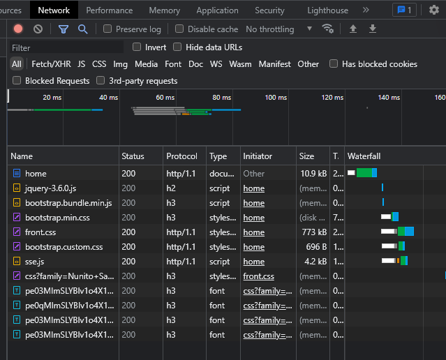
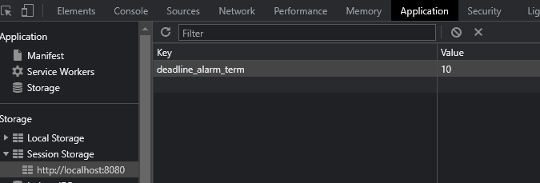

# Problem

endDate가 오늘인 Plan이 현재 있는 상태에서(emphasis=false)

별 이모지를 클릭해서 switchEmphasis 한 후 (emphasis=true)

SSE로직이 작동하지 않는 문제

위처럼 subscribe - sendAlarm 요청이 나가지 않고

msgLastSentTime도 sessionStorage에서 지워져 있다.

 

## <b> ▶️ trial </b>

- explanation
    #### <b> 🔻minor issue </b>

 

## <b> ✅ success </b>