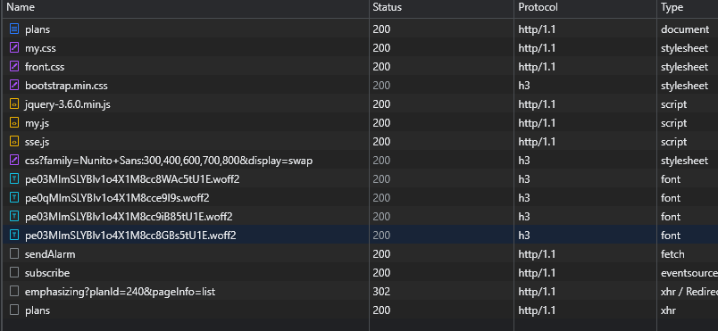
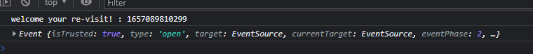
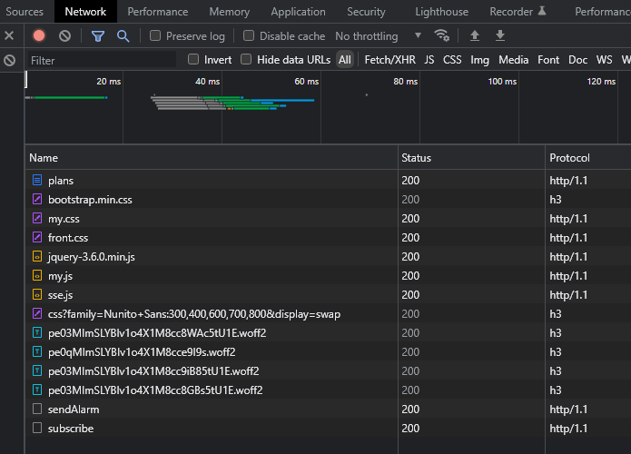
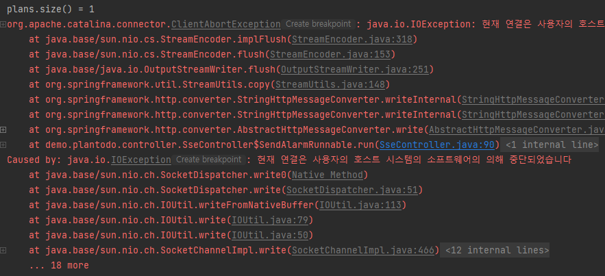

# Problem

로그인 후 urgentPlan이 하나도 없어서 thread를 바로 벗어난 경우 메세지를 보내지 않기 때문에 msgLastSentTime을 기록하지 못한다. 그래서 로그아웃하지 않은 상태에서 plans페이지에서 switchEmphasis하거나 새로운 plan을 추가해도 subscribe - sendAlarm 하지 않는다.

## <b> ▶️ trial1 </b>

subscribe시 dummy event를 전송할 때도 msgLastSentTime을 sessionStorage에 저장하도록 했다.

```js
/*로그인 후 첫 home 접속 (alarmStart cookie가 있어야 함)*/
if (sessionStorage.getItem("deadline_alarm_term") === null) {
    /*sessionStroage에 deadline_alarm_term 정보 저장*/
    sessionStorage.setItem("deadline_alarm_term", $("#deadline_alarm_term").val());

    sseBasicLogic();

} else {
    let msgLastSentTime = sessionStorage.getItem("msgLastSentTime");
    console.log("welcome your re-visit! : " + msgLastSentTime);
    if (msgLastSentTime != null) {
        let deadline_alarm_term = sessionStorage.getItem("deadline_alarm_term");
        let waitTime = (new Date().getTime() - msgLastSentTime) % deadline_alarm_term;

        /*waitTime만큼 기다리기*/
        setTimeout(sseBasicLogic(), waitTime * 1000);
    }
}

function sseBasicLogic() {
    /*subscribe*/
    let uri = "/sse/subscribe";
    const eventSource = new EventSource(uri);

    /*sendAlarm*/
    fetch(`/sse/sendAlarm`);

    /*eventSource onopen, onerror, onmessage*/
    eventSource.onopen = (e) => {
        sessionStorage.setItem("msgLastSentTime", new Date().getTime());
        console.log(e);
    }

    eventSource.onerror = (e) => {
        if (e.currentTarget.readyState == EventSource.CLOSED) {
        } else {
            eventSource.close();
        }
    }

    eventSource.onmessage = (e) => {
        let data = JSON.parse(e.data);
        let msg = "아직 완료되지 않은 일정이 " + data.count + "개 있습니다. 가장 마감이 임박한 일정으로 이동하시겠습니까?";
        let notification = new Notification('현재 메세지', {title: "마감 알림", body: msg});
        notification.actions = [
            {
                action: 'show-uncompleted-action',
                title: 'Message'
            }
        ]
        notification.onclick = function (e) {
            e.preventDefault();
            window.open("/plan/" + data.planId, '_blank');
        }
        setTimeout(notification.close.bind(notification), 5000);

        let lastSent = sessionStorage.getItem("msgLastSentTime");
        sessionStorage.setItem("msgLastSentTime", new Date().getTime());
        console.log("메세지를 다시 보내기까지의 시간 간격 : " + sessionStorage.getItem("msgLastSentTime") - lastSent);
    }
}
```

하지만 마찬가지였다.



사진에서 보이다시피 처음 plans 조회 때 (urgentPlanSize == 0)는 subscribe - sendAlarm 로직이 작동한다.
하지만 emphasizing 로직 후(302 redirect) 다시 get 요청 (plans)을 통해 페이지를 조회한 후에는 subscribe - sendAlarm 로직이 작동하지 않는다.



이것도 위와 같은 상태를 보여준다.

<br>

## <b> ▶️ trial2 </b>

switchEmphasis 로직을 다시 살펴보자.

나는 switchEmphasis 로직 후 같은 페이지로 redirect한다. 그리고 jquery로 post 요청을 보내고 있다.

```js
function switchPlanEmphasis(planId, pageInfo) {
    let uri = "/plan/emphasizing?planId="+planId+"&pageInfo="+pageInfo ;
    $.ajax({
        url: uri,
        type: "POST"
    })
}
```

따라서 post 요청 이후에 javascript 로직이 다시 로딩되지 않는 것이 문제인 것 같다. javascript 로직을 ajax 요청 후 다시 로딩하는 방법을 찾아보자.

[document](https://stackoverflow.com/questions/58116524/how-to-load-javascript-file-in-the-success-section-of-ajax-call)


- $(document).ready()에 sse 클라이언트 로직을 매핑 -> failed

- switchEmphasis가 끝났을 때 location.reload(true); -> failed
    ```js
    function switchPlanEmphasis(planId, pageInfo) {
        let uri = "/plan/emphasizing?planId="+planId+"&pageInfo="+pageInfo ;
        $.ajax({
            url: uri,
            type: "POST"
        }).done(function () {
            location.reload(true);
        })
    }
    ```


subscribe - sendAlarm 로직이 실행되지만



이렇게 IOException이 발생하면서 SSE 연결이 끊기고 기다려도 다시 reconnect되지 않는다.

- explanation
    #### <b> 🔻minor issue </b>

<br>

## <b> ✅ success </b>