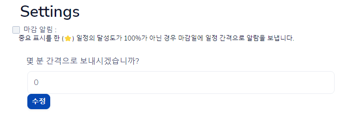

# Problem

체크박스가 체크되지 않는다.



위의 이미지에서 deadline_alarm은 true 상태. 아래의 폼은 정상적으로 inline 상태로 보이나 체크박스는 checked표시가 되지 않는다.

## <b> ▶️ trial1 </b>

[document](https://stackoverflow.com/questions/9780144/my-checkbox-will-not-check-when-clicked)

- event.preventDefault() 삭제하기 -> failed
- th:field를 같이 사용하고 있는지 확인하기 -> failed
    th:field를 사용하면 th:checked값을 override한다고 한다.

<br>

## <b> ✅ success </b>

```html
<div class="form-check">
    <div id="settingsUpdateForm">
        <input type="hidden" id = "settings_id" th:value="${settingsUpdateForm.settings_id}">
        <input type="hidden" id = "notification_perm" th:value="${settingsUpdateForm.notification_perm}">
        <div class="row">
            <label class="form-check-label" id="deadline_alarm_label" for="deadline_alarm">마감 알림 : <span th:if="${settingsUpdateForm.isDeadline_alarm()}" th:text="${settingsUpdateForm.deadline_alarm_term + '분마다'}"></span></label>
            <input type="checkbox" id="deadline_alarm" name="deadline_alarm" class="checkbox" th:checked="${settingsUpdateForm.isDeadline_alarm() ? true : false}">
            <small class="text-dark">중요 표시를 한 (⭐) 일정의 달성도가 100%가 아닌 경우 마감일에 일정 간격으로 알람을 보냅니다.</small>
        </div>
        <div class="row" id="termBlock" th:style="${settingsUpdateForm.isDeadline_alarm() ? 'display:inline;' : 'display:none;'}">
            <label class="form-label" for="deadline_alarm_term">몇 분 간격으로 보내시겠습니까?</label>
            <div class="col-md-6">
                <input type="text" id="deadline_alarm_term" name="deadline_alarm_term" class="form-control" th:value="${settingsUpdateForm.deadline_alarm_term}">
            </div>
            <div class="col-md-6">
                <button type="button" id="deadline_alarm_submit" class="btn btn-sm btn-primary">수정</button>
            </div>
        </div>
    </div>
</div>
```

여기서 맨 위에 있는 div를 삭제한다.
스위치를 사용하려고 form-check form-switch를 붙였었는데 이게 checkbox checked 옵션과 충돌하면서 발생한 문제인 것 같다.