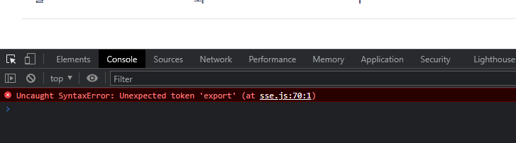

# Problem

my.js에서 sse.js의 sseBaseCondition()을 호출하기 위해서 sse.js에서 export했다.



그랬더니 이런 에러가 발생한다.

<br>
<br>

## <b> ▶️ trial1 </b>

[document](https://pgramdiary.tistory.com/85)

package.json에 type: module을 맨 마지막에 추가해 주었다.

<br>

## <b> ▶️ trial2 </b>

[document](https://stackoverflow.com/questions/69153621/syntaxerror-unexpected-token-export-while-exporting-function-js)

export 문법은 ES6문법이기 때문에 내가 CommonJS 모듈을 사용하고 있다면 인식하지 못한다고 한다. 따라서 CommonJS 문법을 사용하거나 아예 ES6를 사용하던가 깔려있는 webpack으로 import를 하던가 선택을 해야 한다.

<br>

## <b> ▶️ trial3 </b>

```js
// sse.js
const sseBaseConditionConst = function() {
    return sseBaseCondition();
}

exports.sseBaseCondition = sseBaseConditionConst;

// my.js
const sse = require("./sse");
```

이런 식으로 CommonJS 문법을 사용해 보았지만 같은 에러가 발생한다.

<br>

## <b> ▶️ trial3 </b>

나는 webpack을 사용하고 있기 때문에 webpack을 통해서 import/export를 해야 제대로 작동할 것이라고 한다... 그 말은 webpack을 제대로 공부해야 할 시점이 왔다는 말이다.


- explanation
    #### <b> 🔻minor issue </b>

<br>

## <b> ✅ success </b>