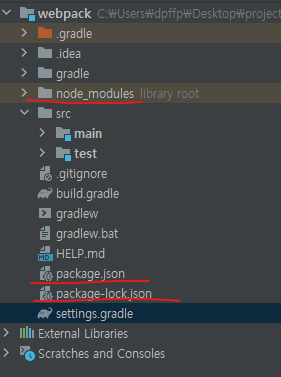

원래 하던 프로젝트에 webpack을 적용하려니 뭐가 뭔지 하나도 모르겠다.

그래서 작은 연습용 프로젝트를 새로 만들어서 거기에 webpack을 적용해 보기로 했다.

[1] 스프링 부트 프로젝트 생성

spring.start.io로 들어가서 gradle 프로젝트를 생성한다.

[2]

Basic Setup

```console
npm install webpack webpack-cli --save-dev
```



이런 파일들이 생성되었다.


[3] 

[document](https://m.blog.naver.com/weekamp/221924672807)


[document](https://webpack.js.org/configuration/entry-context/#root)

context : alsolute path를 사용해야 함. configuration에서 entry points나 loaders를 확인하기 위한 기본 디렉토리

entry : application bundle process가 시작하는 점

HTML 페이지마다 하나의 entry point를 가진다. 따라서 single page application은 하나의 엔트리 포인트를, multiple page application은 여러 개의 entry point를 가져야 한다.

```js
module.exports = {
  //...
  entry: {
    home: './home.js',
    about: './about.js',
    contact: './contact.js',
  },
};
```

그리고 

[document](https://www.edureka.co/community/85787/how-to-copy-static-files-to-build-directory-with-webpack)

